<!-- section start -->
<!-- attr: { class:'slide-title', showInPresentation:true, hasScriptWrapper:true, style:'' } -->
# ASP.NET Web Controlsand HTML Controls
<div class="signature">
    <p class="signature-course">Telerik Software Academy</p>
    <p class="signature-initiative">http://academy.telerik.com </p>
    <a href = "ASP.NET Web Forms" class="signature-link">ASP.NET Web Forms</a>
</div>

<!-- attr: { showInPresentation:true, hasScriptWrapper:true, style:'' } -->
# Table of Contents
- Controls Class Hierarchy in Web Forms
- HTML Server Controls
- Web Server Controls
  - Basic Web Controls
  - Validation Controls
  - List Controls
  - Rich Controls
- HTML Escaping

<!-- attr: { showInPresentation:true, hasScriptWrapper:true, style:'' } -->
# What is ASP.NET Server Control?
- ASP.NET `server controls`
  - The simplest ASP.NET components
  - Wrap an HTML UI element, or more complex UI
  - Component-oriented programming model
  - Executed and rendered at the server side
- Example of ASP.NET server controls:
  - `<asp:Button>` &rarr; `<input type="submit">`
  - `<asp:Label>` &rarr; `<span>`
  - `<asp:GridView>` &rarr; `<table><tr><td>…`

<!-- attr: { showInPresentation:true, style:'' } -->
# What is ASP.NET Server Control? (2)
- Mandatory properties for all server controls:
  - `runat="server"`
  - `ID="…"`
- Programming model `based on events`
  - Each user interaction causes an event
  - Developer decides which events to handle
- Browser-specific HTML is generated
  - Controls deliver appropriate HTML depending on browser type

<!-- section start -->
<!-- attr: { class:'slide-section', showInPresentation:true, hasScriptWrapper:true, style:'' } -->
# Controls – Class Hierarchy

<!-- attr: { showInPresentation:true, hasScriptWrapper:true, style:'' } -->
# Controls – Class Hierarchy
- `System.Web.UI.Control`
  - Base class for all controls
  - Properties – `ID`, `Page`, `Context`, `ViewState`, `ClientIDMode`, `Controls` , `Parent`, `Visible`
  - Methods – `Render(HtmlTextWriter writer)`

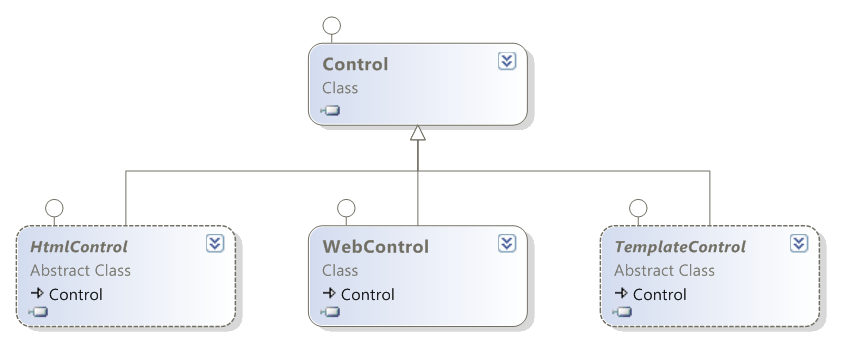

<!-- attr: { showInPresentation:true, hasScriptWrapper:true, style:'' } -->
# Controls – Class Hierarchy (2)
- `System.Web.UI.HtmlControls.HtmlControl`


<!-- attr: { showInPresentation:true, hasScriptWrapper:true, style:'font-size: 42px' } -->
# Controls – Class Hierarchy (3)
- `System.Web.UI.WebControls.WebControl` 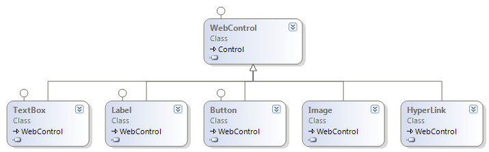
- `System.Web.UI.TemplateControl` 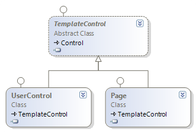

<!-- section start -->
<!-- attr: { class:'slide-section', showInPresentation:true, hasScriptWrapper:true, style:'' } -->
# HTML Server Controls

<!-- attr: { showInPresentation:true, hasScriptWrapper:true, style:'' } -->
# HTML Server Controls
- HTML server controls are very simple extension of `Control` class
- Look like traditional HTML
  - Defined by `runat="server"`
  - Simple HTML seems like text on the server
  - If an HTML element is converted to HTML server control, a server side object is associated with it
- Valid only inside a Web form tag:
- `<form runat="server">…</form>`

<!-- attr: { showInPresentation:true, style:'' } -->
# HTML Server Control – Example

```aspx
<%@ Page Language="C#" %&#62;
&#60;script language="c#" runat="server"&#62;
  void ButtonSubmit_Click(Object sender, EventArgs e) {
    Response.Write("Value:&#60;b&#62;"+TextField.Value+"&#60;/b&#62;");
  }
&#60;script&#62;
&#60;html&#62;
&#60;head&#62;&#60;title&#62;HTML Server Controls&#60;/title&#62;&#60;/head&#62;
&#60;body&#62;
  &#60;form id="formMain" runat="server"&#62;      
    &#60;input id="TextField" type="text" runat="server" /&#62;
    &#60;input id="ButtonSubmit" type="button"
      runat="server" value="Submit"
      onserverclick="ButtonSubmit_Click" /&#62;
  &#60;/form&#62;
&#60;/body&#62;
&#60;/html&#62;
```

<!-- attr: { class:'slide-section demo', showInPresentation:true, hasScriptWrapper:true, style:'' } -->
<!-- # HTML Server Controls -->
##  [Demo]()

<!-- attr: { showInPresentation:true, hasScriptWrapper:true, style:'' } -->
# HTML Server Control Classes
  - HtmlForm – `<form>…</form>`
  - HtmlInputText – `<input type="text">`
- HtmlButton – `<input type="button" />`
  - HtmlAnchor – `<a href="…">…</a>`
- HtmlSelect – `<input type="select">`
- HtmlTable, `HtmlTableCell`, `HtmlTableRow` – `<table><tr><td>…</td></tr></table>`
- HtmlImage – ``
-  ...

<!-- attr: { showInPresentation:true, hasScriptWrapper:true, style:'' } -->
# HTML Server Control Classes (2)
- `HtmlGenericControl`
  - Used for all other HTML elements
  - `<p>`
  - `<div>`
  - `<span>`
  - `<meta>`
  - `<body>`
  -  …

<!-- attr: { showInPresentation:true, style:'' } -->
# HtmlGenericControl – Example

```aspx
&#60;%@ Page Language="C#" %&#62;
&#60;script runat="server"&#62;
  void Page_Load(Object sender, EventArgs e) {
    this.MetaInfo.Attributes["name"] = "description";
    this.MetaInfo.Attributes["content"] = "The page was
      generated on: " + DateTime.Now.ToString();
	} 
&#60;script&#62;
&#60;html&#62;
&#60;head&#62;
  &#60;meta id="MetaInfo" runat="server" /&#62; 
&#60;/head&#62;
&#60;body&#62;
  &#60;form id="formMain" runat="server"&#62;…&#60;/form&#62;
&#60;/body&#62;
&#60;/html&#62;
```

<!-- attr: { class:'slide-section demo', showInPresentation:true, hasScriptWrapper:true, style:'' } -->
<!-- # HTML Generic Controls -->
##  [Demo]()

<!-- section start -->
<!-- attr: { class:'slide-section', showInPresentation:true, hasScriptWrapper:true, style:'' } -->
# Web Server Controls

<!-- attr: { showInPresentation:true, style:'' } -->
# Web Server Controls
- Web server controls are server UI controls that abstract the common HTML elements
  - Have own lifecycle and functionality
- Built-in with .NET Framework
  - Located in `System.Web.UI.WebControls` namespace
  - Inherit from the `WebControl` class
- The rendered HTML tags are quite different from the design-time markup

<!-- attr: { showInPresentation:true, hasScriptWrapper:true, style:'' } -->
# Web Server Controls – Features
- Rich functionality
- Type-safe programming capabilities
- Automatic Web browser detection
- AutoPostBack
  - Submit when the focus is lost
- Support for themes

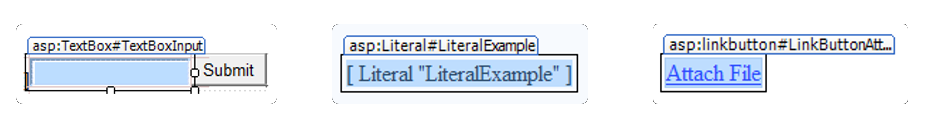

<!-- attr: { showInPresentation:true, hasScriptWrapper:true, style:'' } -->
# Web Server Controls – Syntax
<br>
<br>
<br>
<br>
```aspx
<tag_prefix:controlname attributes runat="server">
```


<!-- attr: { showInPresentation:true, style:'' } -->
# Web Server Control – Example

```aspx
&#60;form id="formMain" runat="server"&#62;
  &#60;asp:Label ID="LabelResult" runat="server"
    Text="" Visible="false" /&#62;
  &#60;asp:TextBox ID="TextBoxInput" runat="server" /&#62;
  &#60;asp:Button ID="ButtonSubmit" runat="server" 
    Text="Submit" OnClick="ButtonSubmit_Click" /&#62;
&#60;/form&#62;
```

```cs
protected void ButtonSubmit_Click(
  object sender, EventArgs e)
{
  this.LabelResult.Text = 
    "You entered: " + this.TextBoxInput.Text;
  this.LabelResult.Visible = true;
}
```

<!-- attr: { class:'slide-section demo', showInPresentation:true, hasScriptWrapper:true, style:'' } -->
<!-- # Web Server Controls -->
##  [Demo]()

<!-- attr: { showInPresentation:true, hasScriptWrapper:true, style:'' } -->
# System.Web.UI. WebControls.WebControl
- The `WebControl` class defines properties, events and methods for all Web controls 
- Control the appearance
  - `BackColor`
  - `ForeColor`
  - `BorderWidth`
  - `BorderStyle`
  - `BorderColor`

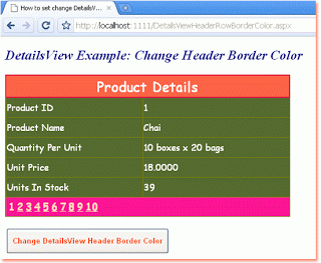

<!-- attr: { showInPresentation:true, hasScriptWrapper:true, style:'' } -->
# System.Web.UI. WebControls.WebControl (2)
- Control the behavior
  - `Enabled`
  - `Visible`
  - `TabIndex`
  - `ToolTip`
  - …  
  - Not all controls support all these properties
    - See the documentation for details


<!-- section start -->
<!-- attr: { class:'slide-section', showInPresentation:true, hasScriptWrapper:true, style:'' } -->
# Web Server Controls
##  Basic Web Controls

<!-- attr: { showInPresentation:true, hasScriptWrapper:true, style:'' } -->
# Basic Web Controls ↔ HTML

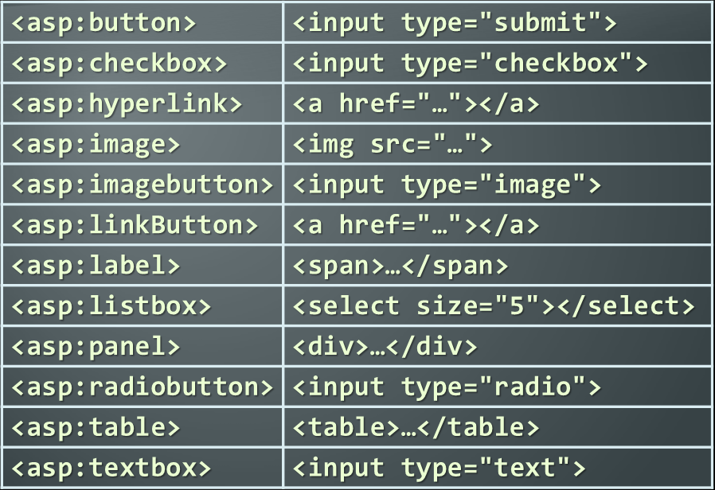

<!-- attr: { showInPresentation:true, hasScriptWrapper:true, style:'' } -->
# Basic Web Controls: TextBox
- Creates single-line or multiline text-box
- Lets the user to enter text
- Properties
  - `Text`
  - `TextMode` – `SingleLine`, `MultiLine`, `Password`
  - `MaxLength`
  - `ReadOnly`
  - `AutoPostBack`
- Events
  - `TextChanged` – combined with `AutoPostBack`

<!-- attr: { showInPresentation:true, hasScriptWrapper:true, style:'' } -->
# Basic Web Controls: Label
- Display static text in a `<label>` input
- Allows programmatically to manipulate it
- Properties
  - `Text`
<br>
<br>
  - `AssociatedControlID` – on click focus goes to the specified control 
- Events
  - `TextChanged` – combined with `AutoPostBack`
<div class="fragment balloon" style="width:400px; top:30%; left:30%">CAUTION: the `Text` is NOT HTML encoded before it is displayed in the `Label` control. This make it possible to embed script within HTML tags in the text.</div>
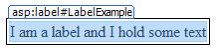

<!-- attr: { showInPresentation:true, hasScriptWrapper:true, style:'' } -->
# Basic Web Controls: Literal
- Display static text
- Allows programmatically to manipulate it
  - Unlike the `Label` control, `Literal` does not let you apply styles to its content
- Properties
  - `Text`
<br>
<br>
- Renders the `Text` property value directly
- Use `Mode="Encode"` for automatic escaping
<div class="fragment balloon" style="width:400px; top:45%; left:30%">CAUTION: the `Text` is NOT HTML encoded before it is displayed in the `Literal` control. This make it possible to embed script within HTML tags in the text.</div>

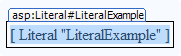

<!-- attr: { showInPresentation:true, hasScriptWrapper:true, style:'' } -->
# Basic Web Controls – Buttons
- Implement `IButtonControl`
  - `Button`, `LinkButton`, `RadioButton`, …
- Properties
  - `Value` – button's title
  - `CommandName` – pass a command
  - `CommandArgument` – pass command arguments
  - `PostBackUrl` – posts back to specified page
  - `CausesValidation` – perform validation or not
  - `ValidationGroup` – which validation group to be validated

<!-- attr: { showInPresentation:true, hasScriptWrapper:true, style:'' } -->
# Basic Web Controls – Buttons (2)
- Button Events
  - `Click`
  - `Command`
    - `CommandName` and `CommandArgument` are passed to the C# code at the server-side

<!-- attr: { showInPresentation:true, style:'font-size: 44px' } -->
# Basic Web Controls – Buttons (3)
- Different button types
  - `Standard button`
    - `System.Web.UI.WebControls.Button`
    - Submits the form by default
    - Has a command name associated(`CommandName` property)
    - Programmatically determine which button is clicked in the `Command` event handlers
    
```aspx
&#60;asp:Button /&#62;
&#60;asp:Button ID="ButtonOK" runat="server"  Text="Click here …" /&#62;
```

<!-- attr: { showInPresentation:true, style:'' } -->
# Basic Web Controls – Buttons (5)
- Different button types
  - `Link button`
    - Same functionality as `Button`
    - Renders as hyperlink
    - Use `Hyperlink` if you want to link to another page
    - Renders JavaScript on the client browser

```aspx
&#60;asp:LinkButton ID="ButtonHomePage"  runat="server" 
Text="Home Page" /&#62;
```

<!-- attr: { showInPresentation:true, style:'' } -->
# Basic Web Controls – Buttons (6)
- Different button types
  - `ImageButton`
    - Display an image that responds on mouse click
    - `ImageURL` – URL to displayed image
    - Both `Click` and `Command` events are raised

```aspx
&#60;asp:ImageButton ID="ButtonSubscribe" runat="server" 
ImageUrl="~/img/btn_subscribe.png" /&#62;
```

<!-- attr: { showInPresentation:true, style:'font-size: 38px' } -->
# Buttons – Example

```html
&#60;%@ Page Language="C#" AutoEventWireup="true" CodeFile="Buttons.aspx.cs"
 Inherits="Buttons" %&#62;
&#60;!DOCTYPE html PUBLIC "-//W3C//DTD XHTML 1.0 Transitional//EN"
  "http://www.w3.org/TR/xhtml1/DTD/xhtml1-transitional.dtd"&#62;
&#60;html xmlns="http://www.w3.org/1999/xhtml"&#62;
&#60;head runat="server"&#62;
    &#60;title&#62;Untitled Page&#60;/title&#62;
&#60;/head&#62;
&#60;body&#62;
  &#60;form id="formMain" runat="server"&#62;
    &#60;asp:Button ID="ButtonEx" 
      CommandName="ButtonEx" 
      runat="server" 
      OnClick="OnBtnClick"
      OnCommand="OnCommand" 
      Text="Normal Button" /&#62;
    &#60;br /&#62;
```

<!-- attr: { showInPresentation:true, style:'' } -->
# Buttons – Example (2)

```aspx
  &#60;asp:LinkButton ID="LinkButtonEx"
    runat="server"
    OnClick="OnBtnClick"
    Text="Link Button"
    CommandName="LinkButtonEx"
    OnCommand="OnCommand" /&#62;
  &#60;br /&#62;
  &#60;asp:ImageButton ID="ImageButtonEx"
    runat="server"
    CommandName="ImageButtonEx"
    ImageUrl="~/images/DotNet_Logo_Small.gif"
    OnCommand="OnCommand"
    OnClick="OnBtnClick" /&#62;        
  &#60;br /&#62;
  &#60;asp:Label ID="LabelMessage" 
    runat="server" Text=""&#62;&#60;/asp:Label&#62;
  &#60;/form&#62;
&#60;/body&#62;
&#60;/html&#62;
```

<!-- attr: { class:'slide-section', showInPresentation:true, hasScriptWrapper:true, style:'' } -->
# Buttons
## Live Demo

<!-- attr: { showInPresentation:true, hasScriptWrapper:true, style:'' } -->
# Basic Web Controls – Panel
- The `Panel` control
  - Container for other controls
  - Rendered as `<div>`
- Useful for:
  - Grouping controls
    - Easier for layout positioning and hiding/showing
  - Generating and inserting controls at runtime


<!-- attr: { showInPresentation:true, style:'' } -->
# Basic Web Controls – Panel (2)
- Properties
  - `ScrollBars` – modify visibility and position of scroll bars
  - `Wrap` – value indicating whether the content wraps within the panel
  - `GroupingText` – caption for the group of controls that is contained in panel control
  - `DefaultButton` – button to be pressed by default (Enter)

<!-- attr: { showInPresentation:true, hasScriptWrapper:true, style:'font-size: 44px' } -->
# Dynamically Generated Controls
- You may generate ASP.NET controls in the controls tree dynamically
- Add controls in the page / control tree in the `Init` / `Load` events
  - If added later, the events from the dynamic controls will not be able to be handled

```cs
protected void Page_Load(object sender, EventArgs e)
{
  TextBox textBox = new TextBox();
  textBox.Text = "Dynamic TextBox";
  this.Controls.Add(textBox);
}
```

<!-- attr: { class:'slide-section demo', showInPresentation:true, hasScriptWrapper:true, style:'' } -->
<!-- # Panels and Dynamic Controls -->
##  [Demo]()

<!-- attr: { showInPresentation:true, hasScriptWrapper:true, style:'' } -->
# Basic Web Controls – MultiView
- `MultiView` displays one of few panels (views) that reside inside it
<br>
<br>
<br>
<br>
  - `ActiveViewIndex` – indicated which of the views to be displayed
  - `SetActiveView` – changes the active view
  - `Views` – holds the views

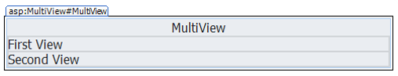

<!-- attr: { showInPresentation:true, style:'' } -->
# Basic Web Controls – CheckBox
- Select between checked / unchecked
- Properties
  - `Checked`
  - `Text` – control caption
  - `AutoPostBack`
    - Automatically posts back the page when control state is changed

```aspx
&#60;asp:CheckBox ID="CheckBoxAgree" runat="server" /&#62;
```

<!-- attr: { showInPresentation:true, style:'' } -->
# Basic Web Controls – CheckBox (2)
  - `CausesValidation` – whether validation is performed
  - `ValidationGroup` – which validation group to be validated
- Events
  - `CheckChanged`

<!-- attr: { showInPresentation:true, hasScriptWrapper:true, style:'' } -->
# Basic Web Controls – RadioButton
- Creates a radio button on the Web Forms page
- Properties
  - `Text`
  - `GroupName` – allow a mutually exclusive selection from the group
  - `AutoPostBack`
    - Automatically posts back the page when control state is changed
- See also `RadioButtonList`


<!-- attr: { showInPresentation:true, hasScriptWrapper:true, style:'' } -->
# Basic Web Controls – PlaceHolder
- The `PlaceHolder` control
<br><br>
- Reserves a space in the page control hierarchy
  - Used to add controls to the page at runtime
  - Does not produce any visible output
- The `Controls` properties
  - Use it to add, insert or remove controls from `PlaceHolder` Control

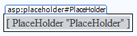

<!-- section start -->
<!-- attr: { class:'slide-section', showInPresentation:true, hasScriptWrapper:true, style:'' } -->
# Validation Controls
##  Performing Control Validation

<!-- attr: { showInPresentation:true, style:'' } -->
# Validation Controls
- The ASP.NET Web forms validation controls
  - Validate the values that are entered  into other controls of the page (e.g. in a `TextBox`)
- Most important validation controls:
  - `RequiredFieldValidator`
  - `RangeValidator`
  - `CompareValidator`
  - `RegularExpressionValidator`
  - `ValidationSummary`

<!-- section start -->
<!-- attr: { class:'slide-section', showInPresentation:true, hasScriptWrapper:true, style:'' } -->
# List Controls
##  Displaying Lists of Items

<!-- attr: { showInPresentation:true, style:'' } -->
# List Controls
- List Web controls
  - Display list of items, e.g. table of rows
  - Support binding to a collection
  - Display rows of data in templated format
- Expose data binding properties: `DataSourceID`, `DataSource`, `DataMember`
  - Bind to collection that support `IEnumerable`, `ICollection` or `IListSource`
  - Can bind to databases through Entity Framework

<!-- attr: { showInPresentation:true, hasScriptWrapper:true, style:'' } -->
# List Controls (2)
- `ListBox`
- `CheckBoxList`
- `RadioButtonList`
- `BulletedList`
- `Repeater`
- `DataList`
- `GridView`
- `DropDownList`
- `ListView`

<!-- attr: { showInPresentation:true, hasScriptWrapper:true, style:'' } -->
# ListBox
- The `ListBox` control
  - Holds a list of items
  - Each item has text					 and value
  - `SelectionMode`: `Single` or `Multiple`
  - Items can be data-bound or provided statically

```aspx
<asp:ListBox ID="ListBoxTowns" runat="server">
  <asp:ListItem Value="1">Sofia</asp:ListItem>
  <asp:ListItem Value="2">Plovdiv</asp:ListItem>
  <asp:ListItem Value="3">Varna</asp:ListItem>
</asp:ListBox>
```


<!-- attr: { showInPresentation:true, hasScriptWrapper:true, style:'' } -->
# DropDownList
- The `DropDownList` control (combo-box)
  - Allows choosing among a list of items,just like `ListBox`
  - Each item has text and value
  - Items can be data-bound or provided statically

```aspx
<asp:DropDownList ID="DropDownListTransport" runat="server"
                  AutoPostBack="True">
   <asp:ListItem Value="2">Bus</asp:ListItem>
   <asp:ListItem Value="1">Train</asp:ListItem>
</asp:DropDownList>
```

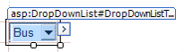

<!-- attr: { showInPresentation:true, hasScriptWrapper:true, style:'' } -->
# BulletedList
- `BulletedList` displays data in the form of a list of bullets
  - `DisplayMode`
    - `Text`, `HyperLink`, `LinkButton`
  - Ordered or unordered
    - `BulletStyle` 
      - Can be `Circle`, `Disk`, `LowerRoman`, …
    - `BulletImageUrl`
  - `FirstBulletNumber`


<!-- attr: { showInPresentation:true, hasScriptWrapper:true, style:'' } -->
# CheckBoxList
- `CheckBoxList` displays items as check boxes
  - `RepeatColumns`
    - The number of columns
  - `RepeatDirection`
    - `Vertical`, `Horizontal`
  - `RepeatLayout`: `Table`, `Flow`

```aspx
<asp:CheckBoxList ID="Extras" runat="server">
  <asp:ListItem Text="Audio System" Value="1">
  <asp:ListItem Text="Parktronic" Value="2"
    Selected="True">
</asp:CheckBoxList>
```

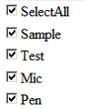

<!-- attr: { showInPresentation:true, hasScriptWrapper:true, style:'' } -->
# RadioButtonList
- `RadioButtonList` displays data as a list of `RadioButton` controls
  - `RepeatColumns` – the number of columns displayed
  - `RepeatDirection`
    - `Vertical`, `Horizontal`
  - `RepeatLayout`
    - `Table`, `Flow`
  - Use the `Items` property to access its elements 

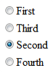

<!-- attr: { class:'slide-section demo', showInPresentation:true, hasScriptWrapper:true, style:'' } -->
<!-- # List Controls -->
##  [Demo]()

<!-- section start -->
<!-- attr: { class:'slide-section', showInPresentation:true, hasScriptWrapper:true, style:'' } -->
# Web Server Controls
##  Rich Controls

<!-- attr: { showInPresentation:true, hasScriptWrapper:true, style:'' } -->
# Rich Controls
- Task-specific controls
- Built with multiple HTML elements
  - Encapsulate more complex functionality
- Rich functionality
- Examples:
  - `Calendar`
  - `Menu`
  - `AdRotator`
  - `CreateUserWizzard`

<!-- section start -->
<!-- attr: { class:'slide-section', showInPresentation:true, hasScriptWrapper:true, style:'' } -->
# HTML Escaping

<!-- attr: { showInPresentation:true, hasScriptWrapper:true, style:'' } -->
# What is HTML Escaping?
- HTML escaping is the act of replacing special characters with their HTML entities
  - Escaped characters are interpreted as character data instead of mark up
- Typical characters to escape
  - `<`, `>` – start / end of HTML tag
  - `&` – start of character entity reference
  - `'`, `"` – text in single / double quotes
  - …

<!-- attr: { showInPresentation:true, hasScriptWrapper:true, style:'' } -->
# HTML Character Escaping
- Each character could be presented as `HTML entity `escaping sequence
- Numeric character references:
  - '`λ`'  is `&#955;`, `&#x03BB`; or `&#X03bb`; 
- Named HTML entities:
  - '`λ`'  is `&lambda; `
  - '`<`' is `&lt;`
  - '`>`' is `&gt;`
  - '`&`' is `&amp;`
  - `"` (double quote) is `&quot;`

<!-- attr: { showInPresentation:true, hasScriptWrapper:true, style:'font-size: 44px' } -->
# How to Encode HTML Entities?
- `HttpServerUtility.HtmlEncode`
  - HTML encodes a string and returns the encoded (html-safe) string
  - `Page.Server` is instance of `HttpServerUtility`
- 	Example:
- 	Output:
- 	Web browser renders the following:

```aspx
<%response.write(Server.HtmlEncode("The image tag: "))%>
```

```html
The image tag: &lt;img&gt; 
```

```html
The image tag:  
```

<!-- attr: { showInPresentation:true, hasScriptWrapper:true, style:'font-size: 44px' } -->
# How to Encode HTML Entities? (2)
- You could also use the following syntax to escape text with HTML tags:

```aspx
<%: "I want to display an  tag here." %>
```
- The best way to safely display text in ASP.NET page is to use `Literal` with `Mode="Encode"`:

```aspx
<asp:Literal Mode="Encode" Text="You could freely
 use  and <p> tags here." />
```
- Never do double-escaping!
- Never store HTML escaped text in the DB!

<!-- attr: { showInPresentation:true, style:'font-size: 44px' } -->
# How to Encode HTML Entities? (3)
- `TextBox` text does not need to be escaped

```aspx
&#60;asp:TextBox Mode="Encode" Text="You could freely
 use &#60;img&#62; and &#60;p&#62; tags here." /&#62;
```
- `Label` text needs to be escaped

```aspx
&#60;asp:Label Mode="Encode"
	Text="&#60;script&#62;alert('bug!')&#60;script&#62;" /&#62;
```
- Difference between `%`, `%:` and `%=`

```aspx
&#60;% “&#60;b&#62;This will not be escaped!&#60;/b&#62;" %&#62;
&#60;%: "I want to display an &#60;img&#62; tag here." %&#62;
&#60;%= "&#60;script&#62;alert('Not good!')&#60;script&#62;" %
```

<!-- attr: { showInPresentation:true, style:'' } -->
# XSS Attack
- `Cross-site scripting (XSS)` is a common security vulnerability in Web applications
  - Web application is let to display a JavaScript code that is executed at the client's browser
    - Crackers could take control over sessions, cookies, passwords, and other private data
- How to prevent XSS?
  - Validate the user input (built-in in ASP.NET)
  - Perform HTML escaping when displaying text data in a Web control

<!-- attr: { showInPresentation:true, style:'font-size: 44px' } -->
# Automatic Request Validation
- ASP.NET applies `automatic request validation`
- Controlled by the `ValidateRequest` attribute of `Page` directive
  - Checks all input data against a hard-coded list of potentially dangerous values
  - The default is `true`
  - Using it could harm the normal work on most applications
    - E.g. a user posts JavaScript code in a forum
  - Escaping is a better way to handle the problem!

<!-- attr: { showInPresentation:true, hasScriptWrapper:true, style:'font-size: 44px' } -->
# Bad Characters Protection
- The ASP.NET built-in protection against XSS
  - By default stops all HTTP requests that send un-escaped HTML code
  - An error message is shown when a form sends HTML to the server
- Disable the HTTP request validation for all pages in `Web.config` (in `<system.web>`):

```xml
<httpRuntime requestValidationMode="2.0" />
<pages validateRequest="false" />
```

```http
500 Internal Server Error: A potentially dangerous Request.
Form value was detected from the client (…)
```

<!-- attr: { class:'slide-section demo', showInPresentation:true, hasScriptWrapper:true, style:'' } -->
<!-- # HTML Escaping -->
##  [Demo]()

<!-- attr: { showInPresentation:true, hasScriptWrapper:true, style:'' } -->
# ASP.NET Web Controls and HTML Controls


<div style="position: absolute; bottom: 1em; right: 0; font-size: 26px;">http://academy.telerik.com</div>

<!-- attr: { showInPresentation:true, hasScriptWrapper:true, style:'font-size: 40px' } -->
# Free Trainings @ Telerik Academy
- "Web Design with HTML 5, CSS 3 and JavaScript" course @ Telerik Academy
    - http://html5course.telerik.com
  - Telerik Software Academy
    - http://academy.telerik.com
  - Telerik Academy @ Facebook
    - https://facebook.com/TelerikAcademy
  - Telerik Software Academy Forums
    - http://forums.academy.telerik.com