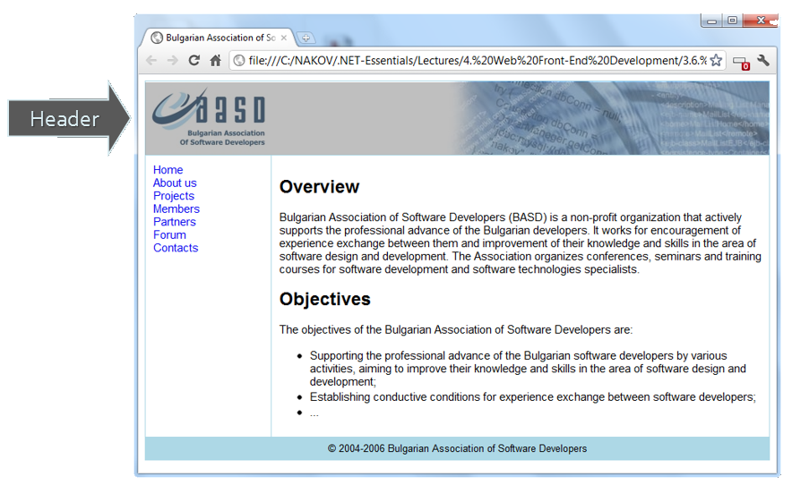
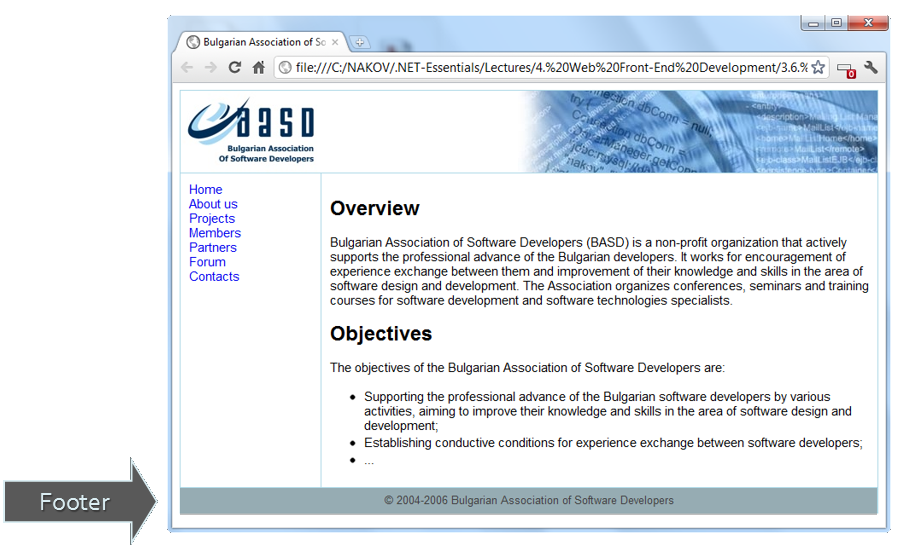
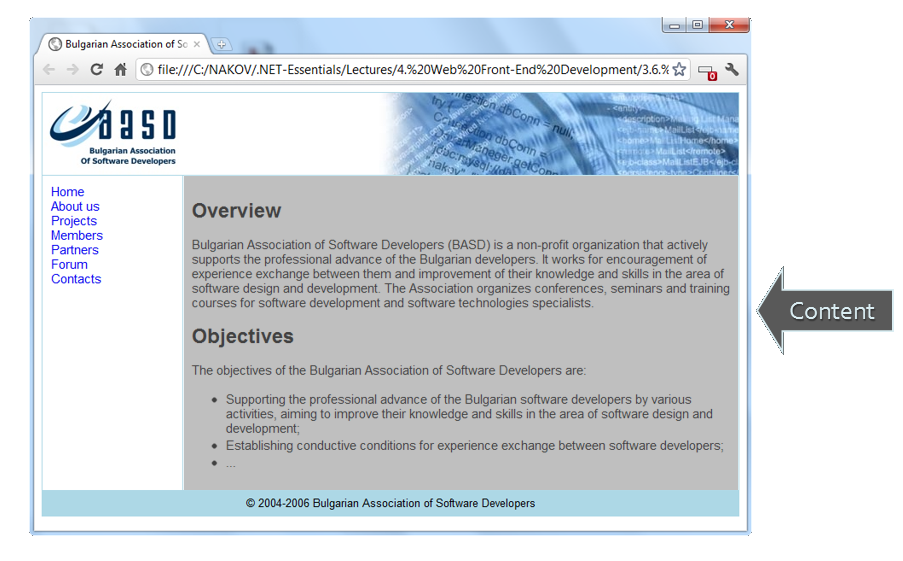
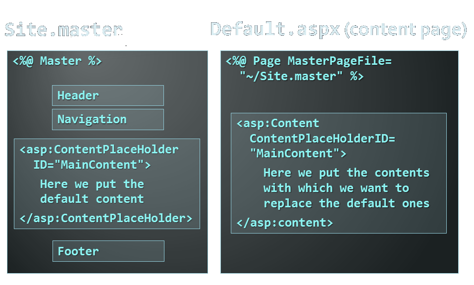

<!-- section start -->
<!-- attr: { class:'slide-title', showInPresentation:true, hasScriptWrapper:true, style:'' } -->
# Master Pages
##  Using ASP.NET Master Pages
<div class="signature">
    <p class="signature-course">Telerik Software Academy</p>
    <p class="signature-initiative">http://academy.telerik.com </p>
    <a href = "ASP.NET Web Forms" class="signature-link">ASP.NET Web Forms</a>
</div>

<!-- attr: { showInPresentation:true, hasScriptWrapper:true, style:'' } -->
# Table of Contents 
- Master Pages and Content Pages
- Nested Master Pages

<!-- section start -->
<!-- attr: { class:'slide-section', showInPresentation:true, hasScriptWrapper:true, style:'' } -->
# Master Pagesand Content Pages

<!-- attr: { showInPresentation:true, hasScriptWrapper:true, style:'' } -->
# Master and Content Pages
- Assume we have a classical web site like this:


<!-- attr: { showInPresentation:true, hasScriptWrapper:true, style:'' } -->
- `Header`
# The Master Page – Sections
- The header is shared between all pages:



<!-- attr: { showInPresentation:true, hasScriptWrapper:true, style:'' } -->
# The Master Page – Sections (2)
- `Navigation`
- The navigation is shared between all pages:


<!-- attr: { showInPresentation:true, hasScriptWrapper:true, style:'' } -->
# The Master Page – Sections (3)
- `Footer`
- The footer is also shared between all pages:



<!-- attr: { showInPresentation:true, hasScriptWrapper:true, style:'' } -->
- `Content`
# The Content Pages
- The content is different for all pages:



<!-- attr: { showInPresentation:true, style:'' } -->
# Why Use Masterand Content Pages?
- Master pages provide reusable UI templates
- The structure of the site is repeatedover most of its pages
  - `ASP.NET master pages `allow to share the common HTML between few pages
- Common `Look & Feel`
- To avoid the repeating (and copying) of HTML code and the logic behind it

<!-- attr: { showInPresentation:true, hasScriptWrapper:true, style:'' } -->
# ASP.NET Master Pages
- Master pages in ASP.NET Web Forms start with the `@Master `directive 
  - Mostly the same attributes as the `@Page `directive
- Master pages can contain:
  - Markup for the page (`<html>`,` <body>`,` …`)
  - Standard contents (HTML, ASP.NET controls)
  - `<asp:ContentPlaceHolder> `controls which can be replaced in the `content pages`

<!-- attr: { showInPresentation:true, hasScriptWrapper:true, style:'' } -->
# Content Pages
- `Content pages `derive the entire content and logic from their master page
- Use the `@Page` directive with `MasterPageFile` attribute pointing to the `master page`
  - Replace a `<asp:ContentPlaceHolder>` from the master page by using the `<asp:Content>` control
  - Set the` ContentPlaceHolderID `property 
    - Points to the `ContentPlaceHolder` from the Master page which content we want to replace

<!-- attr: { showInPresentation:true, hasScriptWrapper:true, style:'' } -->
# Master and Content Pages –  Mechanics




<!-- attr: { class:'slide-section demo', showInPresentation:true, hasScriptWrapper:true, style:'' } -->
<!-- # Using Master Pages -->
##  [Demo]()

<!-- attr: { showInPresentation:true, hasScriptWrapper:true, style:'' } -->
# Master and Content Pages – Advanced


- We can change the Master page at runtime in the code-behind

```cs
Page.MasterPageFile = "~/SiteLayout.master";
```
- We can also select the Master page according to the browser type

```aspx
<%@ Page Language="C#" 
  ie:MasterPageFile="~/IESiteLayout.master"
  mozilla:MasterPageFile="~/FFSiteLayout.master" %>
```

<!-- attr: { showInPresentation:true, style:'font-size: 40px' } -->
# Nested Master Pages
- `Master pages `can be nested, with one master page referencing another as its master
  - `Nested master pages `allow creating componentized master pages
  - A child master page has the file name extension `.master`, as any master page

```aspx
&#60;% @ Master Language="C#" %&#62;    // Parent Master Page
&#60;asp:ContentPlaceHolder ID="MainContent" runat="server"/&#62;
```

```aspx
&#60;%@ Master Language="C#" MasterPageFile="~/Parent.master"%&#62;
&#60;asp:Content ID="Menu" ContentPlaceholderID="MainContent"
    runat="server"&#62;
  &#60;asp:ContentPlaceHolder ID="LeftMenu" runat="server" /&#62;
  &#60;asp:ContentPlaceHolder ID="TopMenu" runat="server" /&#62;
&#60;/asp:Content&#62;                  // Child Master Page
```

<!-- attr: { class:'slide-section demo', showInPresentation:true, hasScriptWrapper:true, style:'' } -->
<!-- # Nested Master Pages -->
##  [Demo]()

<!-- attr: { showInPresentation:true, hasScriptWrapper:true, style:'' } -->
# Master Pages


<div style="position: absolute; bottom: 1em; right: 0; font-size: 26px;">http://academy.telerik.com</div>

<!-- attr: { showInPresentation:true, hasScriptWrapper:true, style:'font-size: 40px' } -->
# Free Trainings @ Telerik Academy
- "Web Design with HTML 5, CSS 3 and JavaScript" course @ Telerik Academy
    - http://html5course.telerik.com
  - Telerik Software Academy
    - http://academy.telerik.com
  - Telerik Academy @ Facebook
    - https://facebook.com/TelerikAcademy
  - Telerik Software Academy Forums
    - http://forums.academy.telerik.com