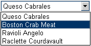
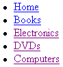
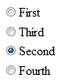
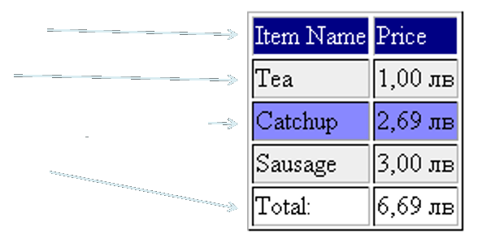
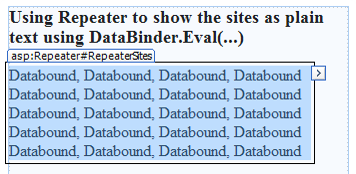
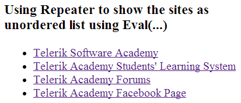
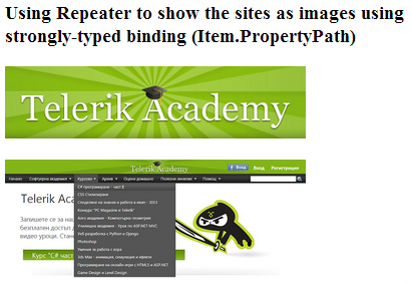

<!-- section start -->
<!-- attr: { class:'slide-title', showInPresentation:true, hasScriptWrapper:true, style:'' } -->
# ASP.NET Data Binding
##  Binding UI Controls to Data Classes in Web Forms
<div class="signature">
    <p class="signature-course">Telerik Software Academy</p>
    <p class="signature-initiative">http://academy.telerik.com </p>
    <a href = "ASP.NET Web Forms" class="signature-link">ASP.NET Web Forms</a>
</div>

<!-- attr: { showInPresentation:true, hasScriptWrapper:true, style:'' } -->
# Table of Contents
- Data Binding Concepts
- Binding List Controls
- Declarative Data Binding
- Complex Data-Bound Controls
- Templates and Template Controls
- `Container.DataItem`, `Eval(…)` andStrongly-Typed Binding
- Using `GridView`, `FormView`, `DetailsView`, `Repeater`, `ListView`, `DataPager`

<!-- section start -->
<!-- attr: { class:'slide-section', showInPresentation:true, hasScriptWrapper:true, style:'' } -->
# How Data Binding Works in ASP.NET?

<!-- attr: { showInPresentation:true, style:'' } -->
# What is Data Binding?
- `Data binding `is the process of filling data from a data source into a control
  - ASP.NET Web Forms controls supporting data binding have
    - A property `DataSource`
    - A method `DataBind()`
  - To bind a control we have to set the property `DataSource` and to call the method `DataBind() `after that
  - Binding is usually invoked in `Page_Load()`

<!-- attr: { showInPresentation:true, style:'' } -->
# Data Binding – Simple Example

```aspx
&#60;asp:DropDownList ID="DropDownYesNo" runat="server"&#62;
    &#60;asp:ListItem&#62;Yes&#60;/asp:ListItem&#62;
    &#60;asp:ListItem&#62;No&#60;/asp:ListItem&#62;
&#60;/asp:DropDownList&#62;
    Example of static list control with items:
    Example of data-bound list control:
&#60;asp:ListBox ID="ListBoxTowns" runat="server"&#62;
&#60;/asp:ListBox&#62;
```

```cs
protected void Page_Load(object sender, EventArgs e)
{
  string[] towns = { "Sofia", "Plovdiv", "Varna" };
  this.ListBoxTowns.DataSource = towns;
  this.ListBoxTowns.DataBind();
}
```

<!-- attr: { class:'slide-section demo', showInPresentation:true, hasScriptWrapper:true, style:'' } -->
<!-- # Data Binding: Simple Example -->
##  [Demo]()

<!-- attr: { showInPresentation:true, style:'' } -->
# List-Bound Controls
- Controls that are bound to a data source are called list-bound controls
- `ListBox`, `DropDownList`, `CheckBoxList`, `RadioButtonList`
- `DataList` – shows data in a template-based predefined pattern
- `GridView` – shows data in a table
- `Repeater` – shows data in a template designed by the programmer

<!-- attr: { showInPresentation:true, style:'' } -->
# When Does Binding Take Place?
- Data binding in ASP.NET can occur:
  - In `Page_Load()` or `Page_PreRender()`
    - Sometimes `Page.IsPostBack` is checked
    - `Page_Load()` – called before control events 
    - `Page_PreRender()` – called after control events
  - In an event handler:
    - E.g. when a button is pressed, in the `ButtonLoad_Click()` event handler
- Data binding transfers the data from the data source to the control's internal structures

<!-- attr: { showInPresentation:true, style:'' } -->
# Sources of Data
- Any class deriving from `IEnumerable` can be used as data source in ASP.NET Web Forms
  - Arrays, e.g. `Town[]`
  - Lists, e.g. `List<Town>`
  - LINQ-to-Entities query over Entity data model
  - LINQ-to-XML, LINQ-to-Objects queries
  - Etc.
- ASP.NET data-source classes
  - `EntityDataSource`, `ObjectDataSource`, …
- `DataTable` and `DataSet` classes

<!-- attr: { showInPresentation:true, style:'' } -->
# List-Bound Controls:Common Properties
- To connect a list-bound controls to a data source use the properties:
  - `DataSource`
    - Assigns the data source
  - `DataMember`
    - Optionally indicates the object inside the data source: a property or a property path
    - E.g. `DataSource` `=` `students`,`DataMember` `=` `Address.Town`

<!-- attr: { showInPresentation:true, style:'' } -->
# Common Properties (2)
- List controls (`ListBox`, `DropDownList`, `CheckBoxList` and `RadioButtonList`) have additional common properties
  - `DataTextField` – the column (property) which will be displayed on the page
    - E.g. `CustomerName`
  - `DataValueField` – the column that will provide the value for the control
    - E.g. `CustomerID`

<!-- section start -->
<!-- attr: { class:'slide-section', showInPresentation:true, hasScriptWrapper:true, style:'' } -->
# Binding List Controls

<!-- attr: { showInPresentation:true, hasScriptWrapper:true, style:'' } -->
# List Controls
- Abstract class `ListControl` is base class for all list controls
  - `ListBox`
  
  - `DropDownList`
  
  - `BulletedList`
  
  - `CheckBoxList`
  
  - `RadioButtonList`
  
  - `…`









<!-- attr: { showInPresentation:true, style:'' } -->
# Binding List Controls
- Common binding-related properties
  - `DataSourceID` – for declarative data binding
  - `DataTextField` – field to display
  - `DataTextFormatString` – field display format
  - `DataValueField` – field to take as result
  - `AutoPostBack` – forces postback on user click
  - `Items` – contains the list items
- Common events
  - `SelectedIndexChanged`

<!-- attr: { showInPresentation:true, hasScriptWrapper:true, style:'' } -->
# Binding List Controls – Example

```aspx
<asp:BulletedList
  ID="BulletedListMenu"
  runat="server"
  DisplayMode="HyperLink"
  DataTextField="Text"
  DataValueField="Url">
</asp:BulletedList>
```
 
```cs
var urls = new[]
{
  new { Text="Google", Url="http://www.google.com" },
  new { Text="Bing!", Url="http://www.bing.com" },
  new { Text="MSDN", Url="http://msdn.microsoft.com" }
};
this.BulletedListMenu.DataSource = urls;
this.BulletedListMenu.DataBind();
```

<!-- attr: { class:'slide-section demo', showInPresentation:true, hasScriptWrapper:true, style:'' } -->
<!-- # Binding List Controls -->
##  [Demo]()

<!-- section start -->
<!-- attr: { class:'slide-section', showInPresentation:true, hasScriptWrapper:true, style:'' } -->
# Declarative Data Binding in the ASP.NET Controls

<!-- attr: { showInPresentation:true, style:'' } -->
# Declarative Data Binding Syntax

- ASP.NET Web Forms offers a declarative syntax for data-binding
- `<%#: expression %>` – binding with escaping
- `<%# expression %>` – unescaped binding
- Evaluated when the `DataBinding` event of the corresponding control is fired for each item (i.e. record / row) in the data source
- The `DataBinder` class is used internally to retrieve the value in a column

<!-- attr: { showInPresentation:true, style:'' } -->
# Data-Binding Syntax – Example

```aspx
// Binding to a property
Customer: <%# this.CustID %>
// Binding to a collection (e.g. array)
Orders: <asp:ListBox ID="ListBoxCountries"
  DataSource="<%# this.Arr %>" runat="server">
// Binding to an expression
Contact: <%#: (customer.FirstName + " " +
  customer.LastName) %>
// Binding to the output of a method
Outstanding Balance: <%# GetBalance(custID) %>
// Strongly-typed binding to a collection
City: <%#: Item.Address.City.Name %>
```

<!-- attr: { showInPresentation:true, style:'font-size: 42px' } -->
# How Declarative Binding Works?
- Although declarative binding is similar to `<% Response.Write()%>` its behavior is different
- `Response.Write(…)` is evaluated (calculated) when the page is compiled
  - The declarative binding syntax is evaluated when the `DataBind(…)` method is called
  - If `DataBind(…)` is never called, the expression `<%# … %>` is not displayed
  - During the evaluation in binding, the `current data item `is accessible (`Container.DataItem`)

<!-- attr: { showInPresentation:true, style:'' } -->
# The DataBind(…) Method
- `Page` and all server controls have `DataBind(…)` method
- `DataBind(…)` is called in a cascading order for all controls in the parent control
  - Evaluates all the `<%# … %>` expressions
  - `DataBind(…)` is usually called in the `Page_Load` or `Page_Prerender` events

```cs
void Page_Load(Object sender, EventArgs e)
{  
  Page.DataBind(); // Binds all control in the page
}
```

<!-- attr: { showInPresentation:true, style:'' } -->
# Declarative Binding – Example

```aspx
&#60;form runat="server"&#62;
  &#60;asp:DropDownList id="lstOccupation"
    AutoPostBack="true" runat="server"&#62;
    &#60;asp:ListItem&#62;Manager&#60;/asp:ListItem&#62;
    &#60;asp:ListItem&#62;Developer&#60;/asp:ListItem&#62;
    &#60;asp:ListItem&#62;Tester&#60;/asp:ListItem&#62;
  &#60;/asp:DropDownList&#62;
  &#60;p&#62;
    You selected:
    &#60;asp:Label id="lblSelectedValue"
      Text="&#60;%#: lstOccupation.SelectedItem.Text %&#62;"
      runat="server" /&#62;
  &#60;/p&#62;
&#60;/form&#62;
```

<!-- attr: { showInPresentation:true, style:'' } -->
# Strongly-Typed Binding
- List controls in ASP.NET have `ItemType` property to specify its bound item type
  - Strongly-typed ASP.NET controls have the property `Item` at runtime of type `ItemType`

```aspx
&#60;asp:Repeater ID="RepeaterPeople" runat="server" 
  DataSource="&#60;%# GetPeople() %&#62;" ItemType="Person"&#62;
  &#60;ItemTemplate&#62;
    &#60;%#: Item.FirstName %&#62; &#60;%#: Item.LastName %&#62;&#60;br /&#62;
  &#60;/ItemTemplate&#62;
&#60;/asp:Repeater&#62;
```

<!-- attr: { class:'slide-section demo', showInPresentation:true, hasScriptWrapper:true, style:'' } -->
<!-- # Declarative Binding -->
##  [Demo]()

<!-- section start -->
<!-- attr: { class:'slide-section', showInPresentation:true, hasScriptWrapper:true, style:'' } -->
# Complex Data-Bound Controls

<!-- attr: { showInPresentation:true, style:'' } -->
# Complex DataBound Controls
- `GridView`
  - Displays a list of records as a table
  - Supports templates for header, body, items, …
- `DetailsView`
  - Visualizes the details of a record (fields)
  - Supports paging, header / footer, commands
  - Doesn’t support templates
- `FormView`
  - Like `DetailsView` but supports templates

<!-- attr: { showInPresentation:true, style:'' } -->
# GridView
- `GridView` displays tabular data as HTML table
  - Consists of columns, header and footer
  - Columns can be auto-generated according to the data source or can be set explicitly
  - Supports paging, sorting, editing and deleting
  - Easy to adjust the appearance

```aspx
&#60;asp:GridView ID="GridViewCustomers" runat="server"
  AutoGenerateColumns="true" AllowPaging="true" /&#62;
```

<!-- attr: { showInPresentation:true, style:'' } -->
# GridView Columns
- Set `AutoGenerateColumns` to `false` to customize the columns in the `GridView`

<!-- attr: { showInPresentation:true, style:'' } -->
# GridView – Example

```aspx
&#60;asp:GridView ID="GridViewCustomers" runat="server"
    AutoGenerateColumns="false"&#62;
  &#60;Columns&#62;
    &#60;asp:BoundField DataField="FirstName"
      HeaderText="First Name" /&#62;
    &#60;asp:BoundField DataField="LastName"
      HeaderText="Last Name" /&#62;
    &#60;asp:BoundField DataField="Phone"
      HeaderText="Phone" /&#62;
    &#60;asp:BoundField DataField="EMail"
      HeaderText="E-Mail" /&#62;
    &#60;asp:CheckBoxField DataField="IsSenior"
      HeaderText="Senior?" /&#62;
  &#60;/Columns&#62;
&#60;/asp:GridView&#62;
```

<!-- attr: { showInPresentation:true, style:'' } -->
# GridView – Example (2)

```cs
protected void Page_Load(object sender, EventArgs e)
{
  List<Customer> customers = new List<Customer>()
  {
   new Customer() { 
     FirstName = "Nikolay", LastName = "Kostov", 
     Email = "Nikolay@Kostov.com", Phone = "0894 77 22 53",
     IsSenior=true 
   },
   new Customer() { 
     FirstName = "Bai", LastName = "Kenov",
     Email = "bai.Kenov@gmail.com", Phone = "0899 555 444" 
   },
  };
  this.GridViewCustomers.DataSource = customers;
  this.GridViewCustomers.DataBind();
}
```

<!-- attr: { class:'slide-section demo', showInPresentation:true, hasScriptWrapper:true, style:'' } -->
<!-- # GridView -->
##  [Demo]()

<!-- attr: { showInPresentation:true, hasScriptWrapper:true, style:'' } -->
# DetailsView
- Displays a single record
  - Usually used along with `GridView`
- Supports paging, inserting, updating, deleting
- Uses the same fields as `GridView`
  - Declared in a `<Fields> `element
- Easy to change the appearance
- Can auto-generate fields:
  - `AutoGenerateRows="true"`

<!-- attr: { showInPresentation:true, style:'' } -->
# DetailsView – Example

```aspx
&#60;asp:DetailsView ID="DetailsViewCustomer"
  AutoGenerateRows="true" AllowPaging="True" 
  runat="server" onpageindexchanging =
    "DetailsViewCustomer_PageIndexChanging"&#62;
&#60;/asp:DetailsView>
```

```cs
protected void Page_Load(object sender, EventArgs e)
{
  this.DetailsViewCustomer.DataSource = customers;
  this.DetailsViewCustomer.DataBind();
}
protected void DetailsViewCustomer_PageIndexChanging(
  object sender, DetailsViewPageEventArgs e)
{
  this.DetailsViewCustomer.PageIndex = e.NewPageIndex;
  this.DetailsViewCustomer.DataSource = customers;
  this.DetailsViewCustomer.DataBind();
}
```

<!-- attr: { class:'slide-section demo', showInPresentation:true, hasScriptWrapper:true, style:'' } -->
<!-- # DetailsView -->
##  [Demo]()

<!-- attr: { showInPresentation:true, style:'' } -->
# FormView
- Templated version of `DetailsView`
  - Doesn’t use predefined a view
    - Requires the developer to define the view by using `templates`
  - Doesn’t have commands
    - It has mode (view, edit, insert, …)
  - You can use many controls for the templates –  `DropDownList`, `CheckBox`, `Calendar`, etc.

<!-- attr: { showInPresentation:true, hasScriptWrapper:true, style:'' } -->
# FormView (2)
- You are responsible to define some or all of the templates
  - `ItemTemplate`
  - `EditItemTemplate`
  - `InsertItemTemplate`
- You could change the view mode at run-time:

```cs
this.FormViewCustomer.ChangeMode(FormViewMode.Edit);
```

<!-- attr: { showInPresentation:true, style:'' } -->
# FormView – Example

```aspx
&#60;asp:FormView ID="FormViewCustomer" runat="server"
  AllowPaging="True" onpageindexchanging=
  "FormViewCustomer_PageIndexChanging"&#62;
  &#60;ItemTemplate&#62;
    &#60;%#: Eval("FirstName") %&#62;
    &#60;%#: Eval("LastName") %&#62;
  &#60;/ItemTemplate&#62;
&#60;/asp:FormView&#62;
```

```cs
protected void Page_Load(object sender, EventArgs e)
{
  this.FormViewCustomer.DataSource = this.customers;
  this.FormViewCustomer.DataBind();
}
```

<!-- attr: { class:'slide-section demo', showInPresentation:true, hasScriptWrapper:true, style:'' } -->
<!-- # FormView -->
##  [Demo]()

<!-- attr: { showInPresentation:true, style:'' } -->
# The TreeView Control
- `TreeView` is a fully functional control used to display hierarchical data
- Allows multiple visual adjustments
  - Node images, fold and expand images, connecting lines, checkboxes
- Supports navigation and postback
- You can create nodes declaratively or in code
  - We can fill nodes dynamically from the server when needed (when the data is too much)

<!-- attr: { showInPresentation:true, style:'' } -->
# Repeater
- `GridView` doesn’t give you full control
  - Uses HTML tables (`&#60;table&#62;`)
- The `Repeater` control is the most flexible control to show a sequence of data rows
  - Template-based visualization
  - You write the HTML visualization code yourself
- Useful when you want to implement a non-standard visualization of read-only data
  - The output code is manually written

<!-- attr: { showInPresentation:true, hasScriptWrapper:true, style:'' } -->
# Repeater: How to Use It?


<!-- section start -->
<!-- attr: { class:'slide-section', showInPresentation:true, hasScriptWrapper:true, style:'' } -->
# Templates, Eval(…) and Strongly-Typed Binding

<!-- attr: { showInPresentation:true, style:'' } -->
# Templates
- The `GridView`, `Repeater` and `FormView` offer  rich customization based on `templates`
- Data templates
  - Display data in highly-customizable fashion
    - Format the appearance of data
  - `Eval(expression)` or `Item` (in strongly-typed binding) provide access to the current item
  - The current data-bound item is accessible through the `Container.DataItem`

<!-- attr: { showInPresentation:true, hasScriptWrapper:true, style:'' } -->
# Templates (2)
- `<HeaderTemplate>`
- `<ItemTemplate>`
- `<AlternatingItemTemplate>`
- `<FooterTemplate>`
- Example:

```html
<AlternatingItemTemplate>
    <tr style="background: #8888FF">
       <td><%#: Eval("ItemName") %></td>
       <td><%#: Eval("Price", "{0:c}") %></td>
    </tr>
</AlternatingItemTemplate>
```



<!-- attr: { showInPresentation:true, style:'' } -->
# Accessing the Current Item
- Accessing at runtime the current item from the data source collection (`IEnumerable`):
  - `Container.DataItem`
    - Gets the current item as `object`
  - `DataBinder.Eval(container,expression, [format])`
    - Evaluates an expression through reflection
    - Slower than `Container.DataItem`
  - Just use `Eval(expression)` as shortcut

<!-- attr: { showInPresentation:true, style:'' } -->
# DataBinder.Eval() vs. Container. DataItem vs. Eval() vs. Item.Prop

```html
// Using Container.DataItem
<%#: String.Format("{0:c}", ((DataRowView)
  Container.DataItem)["SomeIntegerField"])%>
// Using DataBinder.Eval(…)
<%#: DataBinder.Eval(Container.DataItem,
  "SomeIntegerField", "{0:c}") %>  
// Using Eval(…)
<%#: Eval("SomeIntegerField", "{0:c}") %>
// Using Item.PropertyPath (strongly-typed)
<%#: Item.Address.Town.ID %>
```

<!-- attr: { showInPresentation:true, hasScriptWrapper:true, style:'' } -->
# Repeater – Example

```html
<asp:Repeater id="RepeaterSites" runat="server">
 <ItemTemplate>
  <%#: DataBinder.Eval(Container.DataItem, "Id") %>,
  <%#: DataBinder.Eval(Container.DataItem, "Name") %>,
  <%#: DataBinder.Eval(Container.DataItem, "URL") %>,
  <%#: DataBinder.Eval(Container.DataItem, "ImageURL") %>
</ItemTemplate>
</asp:Repeater>
```




<!-- attr: { showInPresentation:true, hasScriptWrapper:true, style:'' } -->
# Repeater – Example (2) 

```html
<asp:Repeater id="RepeaterTemplatedList" runat="server">
  <HeaderTemplate>
    <ul>
  </HeaderTemplate>
  <ItemTemplate>
    <li>
      <a href="<%#: Eval("URL") %>">
        <%#: Eval("Name") %>
      </a>
    </li>
  </ItemTemplate>
  <FooterTemplate>
    </ul>
  </FooterTemplate>
</asp:Repeater>
```




<!-- attr: { showInPresentation:true, hasScriptWrapper:true, style:'' } -->
# Repeater – Example (3)

```html
<asp:Repeater ID="RepeaterImages" runat="server"
  ItemType="Site">
  <ItemTemplate>
    <p>
      <a href='<%#: Item.URL %>'>    
      ' border="0"
       alt='<%#: Item.Name %>'/>
      </a>
    </p>
  </ItemTemplate>
</asp:Repeater>
```



<!-- attr: { class:'slide-section demo', showInPresentation:true, hasScriptWrapper:true, style:'' } -->
<!-- # Using Repeater with Templates -->
##  [Demo]()

<!-- attr: { showInPresentation:true, style:'' } -->
# ListView
- `ListView` is an extremely flexible data-bound control for displaying lists and tables
  - Works similarly to `GridView`
  - Adds higher-level features
    - Selection, inserting and editing
  - More extensive set of templates than `GridView`
  - Supports paging (through `DataPager`)
  - Groups can display items in tiles (using `GroupTemplate` and `GroupItemCount`)

<!-- attr: { showInPresentation:true, style:'' } -->
# ListView – Templates
- `ItemTemplate `– sets the content of every data item
- `ItemSeparatorTemplate`
- `SelectedItemTemplate`
- `EditItemTemplate`, `InsertItemTemplate`
- `GroupTemplate`
- `EmptyItemTemplate`
- and etc.

<!-- attr: { showInPresentation:true, hasScriptWrapper:true, style:'' } -->
# ListView – Templates and Groups


<!-- attr: { showInPresentation:true, hasScriptWrapper:true, style:'' } -->
# DataPager
- `DataPager` gives you a single, consistent way to use paging with a variety of controls
- The `ListView` is the only control that supports the `DataPager`
- Pager Fields
  - `NextPreviousPagerField`
  - `NumericPagerField`
  - `TemplatePagerField`


<!-- attr: { class:'slide-section demo', showInPresentation:true, hasScriptWrapper:true, style:'' } -->
<!-- # ListView and DataPager -->
##  [Demo]()

<!-- attr: { showInPresentation:true, hasScriptWrapper:true, style:'' } -->
# Using multiple controls

```aspx
<asp:DropDownList runat="server“ ID="DropDownListCategory" 	OnSelectedIndexChanged=“ddlCategory_Changed“
	AutoPostBack="true">
   <asp:ListItem>all</asp:ListItem>
</asp:DropDownList>
<asp:DropDownList runat="server“ ID="DropDownListBrand" 	OnSelectedIndexChanged=“ddlCategory_Changed">
   <asp:ListItem>all</asp:ListItem>
</asp:DropDownList>
```

```cs
protected void ddlCategory_Changed(object sender, EventArgs e)
{
    DropDownList listView = sender as DropDownList;
    string selectedCategory = listView.SelectedValue;
    this.ListViewCars.DataSource =
	  GetBrandsByCategory(selectedCategory);
    this.ListViewCars.DataBind();
}
```

<!-- attr: { showInPresentation:true, hasScriptWrapper:true, style:'' } -->
# ASP.NET Data Binding


<div style="position: absolute; bottom: 1em; right: 0; font-size: 26px;">http://academy.telerik.com</div>