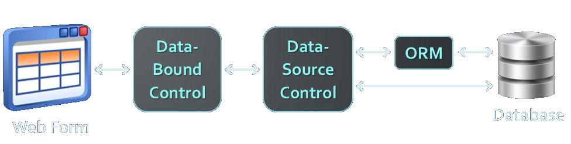
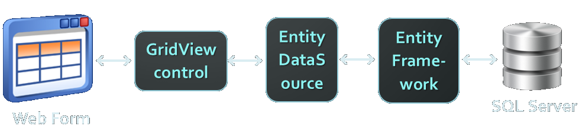
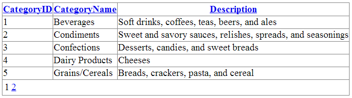
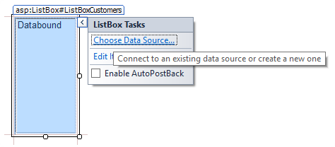
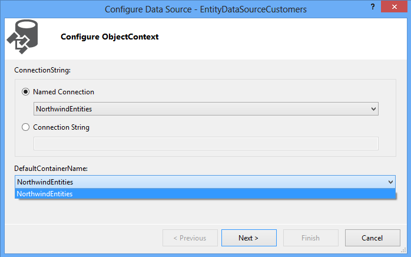
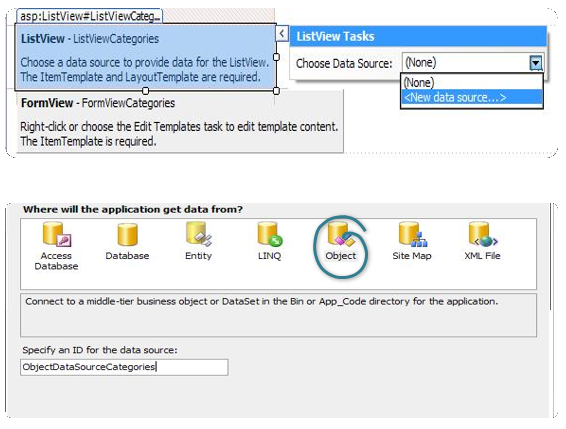
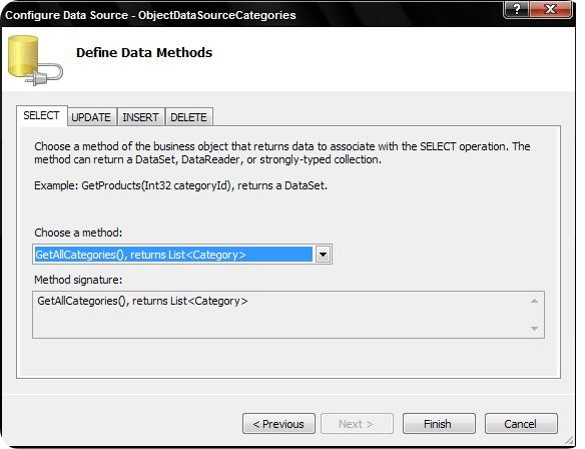
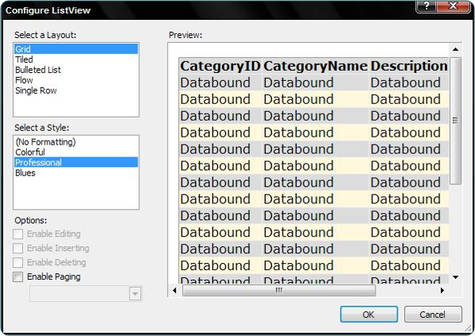

<!-- section start -->
<!-- attr: { class:'slide-title', showInPresentation:true, hasScriptWrapper:true, style:'' } -->
# ASP.NETData Source Controls
##  Building Data-Driven ASP.NET Web Forms Apps
<div class="signature">
    <p class="signature-course">Telerik Software Academy</p>
    <p class="signature-initiative">http://academy.telerik.com </p>
    <a href = "ASP.NET Web Forms" class="signature-link">ASP.NET Web Forms</a>
</div>

<!-- attr: { showInPresentation:true, hasScriptWrapper:true, style:'' } -->
# Table of Contents
- ASP.NET Data Source Controls
  - `SqlDataSource`
  - `EntityDataSource`
  - `ObjectDataSource`
- Accessing ADO.NET Entity Frameworkwith `EntityDataSource`
  - Working with Editable Controls
  - Master-Details Navigation
- Model Binding in Web Forms

<!-- section start -->
<!-- attr: { class:'slide-section', showInPresentation:true, hasScriptWrapper:true, style:'' } -->
# ASP.NET Data Source Controls

<!-- attr: { showInPresentation:true, style:'' } -->
# ASP.NET Data Source Controls
- ASP.NET provides server controls that take care of data binding details
  - Known as `data source controls`
  - `SqlDataSource`, `EntityDataSource`,` ObjectDataSource`, `XmlDataSource`, `…`
- They are an abstraction over the data source
- Data-bound server controls can be associated to a data source control
  - Through the `DataSourceID` property

<!-- attr: { showInPresentation:true, hasScriptWrapper:true, style:'font-size: 44px' } -->
# ASP.NET Data Source Controls
<li> ASP.NET data source controls connect the data-bound controls with the database / ORM:
 </li>

<li style="margin-top: 23%"> Typical scenario:

</li>

<!-- attr: { showInPresentation:true, style:'' } -->
# SqlDataSource
- `SqlDataSource` provides connection to a relational DB (SQL Server, Oracle, OLE DB, …)
- Data is manipulated by using commands
  - `Select`, `Update`, `Insert` and `Delete` commands
  - Commands can be either SQL queries or names of stored procedures
- Data is processed with a `DataSet` (by default)
  - The `DataSourceMode` property specifies whether to use `DataSet` or `DataReader`
- Old-fasioned, better use `EntityDataSource`

<!-- attr: { showInPresentation:true, hasScriptWrapper:true, style:'' } -->
# SqlDataSource – Example

```aspx
<asp:SqlDataSource ID="DSCategories" runat="server" 
  ConnectionString="<%$ ConnectionStrings:Northwind %>" 
  SelectCommand="SELECT x FROM [Categories]" />
<asp:GridView ID="GridViewCategories" runat="server" 
  DataSourceID="DSCategories" DataKeyNames="CategoryID"
  AutoGenerateColumns="True" AllowPaging="True"
  AllowSorting="True">
</asp:GridView>
```



<!-- attr: { class:'slide-section demo', showInPresentation:true, hasScriptWrapper:true, style:'' } -->
<!-- # SqlDataSource and GridView -->
##  [Demo]()

<!-- attr: { showInPresentation:true, style:'' } -->
# EntityDataSource
- The `EntityDataSource`
  - Provides data binding in Web applications that use the ADO.NET Entity Framework (EF)
  - Implements CRUD (create, read, update, and delete) operations
    - Against a database mapped through EF
    - On behalf of data-bound controls 
  - Supports complex queries, sorting and paging
- The Entity Data Model Designer in VS is used to create the EF mappings (`.edmx`)

<!-- attr: { showInPresentation:true, hasScriptWrapper:true, style:'font-size: 42px' } -->
# EntityDataSource – Example
- Define the Entity Data Model (`.edmx`)

<div style="height: 55%"></div>

- Put a list control in the form (e.g. `ListBox`)
```aspx
<asp:ListBox ID="ListBoxCustomers" runat="server">
</asp:ListBox>
```


<!-- attr: { showInPresentation:true, hasScriptWrapper:true, style:'font-size: 42px' } -->
# EntityDataSource – Example (2)
- Bind the `ListBox` to the data model

<div style="height: 35%"></div>

- Select the new "`Entity`" option in the dialog box




<!-- attr: { showInPresentation:true, hasScriptWrapper:true, style:'' } -->
# EntityDataSource – Example (3)
- The VS Designer will then display the available Entity Containers



<!-- attr: { showInPresentation:true, hasScriptWrapper:true, style:'font-size: 44px' } -->
# EntityDataSource – Example (4)
- `ListBox` control bound an `EntityDataSource`:

```aspx
<asp:EntityDataSource
  ID="EntityDataSourceCustomers" runat="server" 
  ConnectionString="name=NorthwindEntities" 
  DefaultContainerName="NorthwindEntities" 
  EntitySetName="Customers" />

<asp:ListBox ID="ListBoxCustomers" runat="server"
  DataSourceID="EntityDataSourceCustomers" 
  DataTextField="CompanyName" Rows="10"
  DataValueField="CustomerID" />
```

<!-- attr: { class:'slide-section demo', showInPresentation:true, hasScriptWrapper:true, style:'' } -->
<!-- # ListBox Bound to EF through EntityDataSource -->
##  [Demo]()

<!-- attr: { showInPresentation:true, hasScriptWrapper:true, style:'font-size: 42px' } -->
# Master-Detail Navigation
- Master-details navigation could be implemented through filtering:

```aspx
<asp:EntityDataSource ID="DSCustomers" runat="server" 
  EntitySetName="Customers" … />
<asp:ListBox ID="ListBoxCustomers" runat="server" 
  DataSourceID="EntityDataSourceCustomers" … />

<asp:EntityDataSource ID="DSOrders" runat="server"
  EntitySetName="Orders" Where="it.CustomerID=@CustID">
    <WhereParameters>
      <asp:ControlParameter Name="CustID" Type="String"
        ControlID="ListBoxCustomers" />
    </WhereParameters>
</asp:EntityDataSource>
```

<!-- attr: { showInPresentation:true, style:'font-size: 42px' } -->
# EntityDataSource: Hints
- To access navigational properties in `EntityDataSource` use "`Include`"

```html
&#60;asp:EntityDataSource ID="DataSourceOrderDetails"
  ConnectionString="name=NorthwindEntities" 
  DefaultContainerName="NorthwindEntities" 
  EntitySetName="Order_Details" Include="Product"
  runat="server" … /&#62;
```
- To use strongly-typed binding (`ItemType`) use `EnableFlattening="false"`

```html
&#60;asp:EntityDataSource ID="DataSourceOrderDetails"
 runat="server" EnableFlattening="false" … /&#62;
```

<!-- attr: { class:'slide-section demo', showInPresentation:true, hasScriptWrapper:true, style:'' } -->
<!-- # Master-Details Navigation (EntityDataSource + Filters) -->
##  [Demo]()

<!-- attr: { showInPresentation:true, hasScriptWrapper:true, style:'' } -->
# Editable EntityDataSource

```html
<asp:EntityDataSource ID="EntityDataSourceCustomers"
  runat="server" ConnectionString="name=…"
  DefaultContainerName="NorthwindEntities"
  EnableInsert="True" EnableUpdate="True"
  EnableDelete="True" EntitySetName="Customers">
</asp:EntityDataSource>

<asp:ListView ID="ListViewCustomers" runat="server"
  DataKeyNames="CustomerID"
  DataSourceID="EntityDataSourceCustomers">
    <LayoutTemplate>…</LayoutTemplate>
    <ItemTemplate>…</ItemTemplate>
    <EditTemplate>…</EditItemTemplate>
    <InsertTemplate>…</InsertItemTemplate>
</asp:ListView>
```

<!-- attr: { showInPresentation:true, hasScriptWrapper:true, style:'' } -->
# BindItem and Bind(…)
- Editable controls require a `two-way binding `(data field &larr;&rarr; UI control)
  - Use `BindItem.Field` for strongly-typed binding instead of `Item.Field`
  - Use `Bind("PropertyPath")` for standard binding instead of `Eval("PropertyPath")`

```html
<EditItemTemplate>
  Company Name: <asp:TextBox ID="TextBoxCompanyName" 
  runat="server" Text='<%# BindItem.CompanyName %>' />
  …
</EditItemTemplate>
```

<!-- attr: { class:'slide-section demo', showInPresentation:true, hasScriptWrapper:true, style:'' } -->
<!-- # Editable ListView with EF and EntityDataSource -->
##  [Demo]()

<!-- attr: { showInPresentation:true, style:'' } -->
# ObjectDataSource
- `ObjectDataSource` enables data-binding of UI control to collection of objects
  - Instead of directly binding to a database
- Needs a middle-tier business object class
  - A class providing the `Select`, `Update`, `Insert`, `Delete` methods (CRUD operations)
- ObjectDataSource properties
  - `TypeName` – name of the business object class
  - `SelectMethod`, `UpdateMethod`, `…`

<!-- attr: { showInPresentation:true, hasScriptWrapper:true, style:'' } -->
# ObjectDataSource – Example

```html
<asp:ObjectDataSource ID="dsProducts"
  runat="server" TypeName="ObjectDataSourceProducts"
  SelectMethod="GetAll" InsertMethod="Insert"
  UpdateMethod="Update" DeleteMethod="Delete">
</asp:ObjectDataSource>

<asp:GridView ID="GridViewProducts" runat="server"
  DataSourceID="dsProducts" DataKeyNames="ProductID">
</asp:GridView>
```

```cs
public class ObjectDataSourceProducts
{
  public IEnumerable<Product> GetAll() { … }
  public int UpdateProduct(Product p) { … }
  …
}
```

<!-- attr: { showInPresentation:true, style:'font-size: 42px' } -->
# Building File System Explorerwith ObjectDataSource
- Define a class to get all files from given folder 
- Add `GetAllFiles()` method to return a collection of `FileInfo` objects

```cs
public class FileSystemManager
{
  public static IEnumerable<FileInfo> 
    GetAllFiles(string folder)
  {
    var files = Directory.GetFiles(folder);
    return files;
  }
}
```

<!-- attr: { showInPresentation:true, hasScriptWrapper:true, style:'font-size: 40px' } -->
# Building File System Explorerwith ObjectDataSource (2)
- Add a `ListView` control in the form
- Bind the `ListView` to the `ObjectDataSource`



<!-- attr: { showInPresentation:true, hasScriptWrapper:true, style:'font-size: 40px' } -->
# Building File System Explorerwith ObjectDataSource (3)
- Next choose your custom class `FilesManager`
- And choose the `GetAllFiles(…) `method as "SELECT Method"




<!-- attr: { showInPresentation:true, hasScriptWrapper:true, style:'font-size: 42px' } -->
# Building File System Explorerwith ObjectDataSource (4)
- Click to configure the `ListView` control
- Optionally choose layout and style




<!-- attr: { showInPresentation:true, hasScriptWrapper:true, style:'font-size: 38px' } -->
# Building File System Explorerwith ObjectDataSource (5)
- Customize the `ListView `to show only rows you like

<div style="height: 45%"></div>

- Add a parameterfor the SELECT method

```html
<SelectParameters>
  <asp:Parameter DefaultValue="C:\WINDOWS"
    Name="rootFolder" Type="String" />
</SelectParameters>
```


<!-- attr: { showInPresentation:true, hasScriptWrapper:true, style:'font-size: 42px' } -->
# Building File System Explorerwith ObjectDataSource (6)
- The result is:


<!-- attr: { class:'slide-section demo', showInPresentation:true, hasScriptWrapper:true, style:'' } -->
<!-- # Using ObjectDataSource -->
##  [Demo]()

<!-- attr: { showInPresentation:true, style:'' } -->
# Other Data Sources
- `LinqDataSource`
  - For LINQ-to-SQL ORM mappings (legacy)
- Hierarchical
  - `XmlDataSource`
    - Establishes a connection to an XML source of data (files, documents)
    - `DataFile`, `TranformFile`, `XPath`
  - `SiteMapDataSource` 
- MS Access – `AccessDataSource`
  - Derives from `SqlDataSource`

<!-- section start -->
<!-- attr: { class:'slide-section', showInPresentation:true, hasScriptWrapper:true, style:'' } -->
# Model Binding
##  CRUD Operations Made Easy

<!-- attr: { showInPresentation:true, style:'' } -->
# What is Model Binding?
- What is "`model`"?
  - In data-driven applications "models" are classes that hold the data behind the UI controls
- What is "`model binding`" in ASP.NET?
  - Bind data controls directly to methods that provide CRUD functionality
  - `SelectMethod `&rarr; returns `IQueryable<T>`
  - `InsertMethod`, `UpdateMethod`, `DeleteMethod` &rarr; edit the model (entity)

<!-- attr: { class:'slide-section demo', showInPresentation:true, hasScriptWrapper:true, style:'' } -->
<!-- # Model Binding -->
##  [Demo]()

<!-- attr: { showInPresentation:true, style:'' } -->
# ASP.NET Data Source Controls
- Questions?

