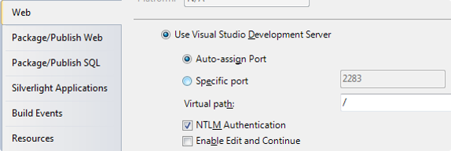
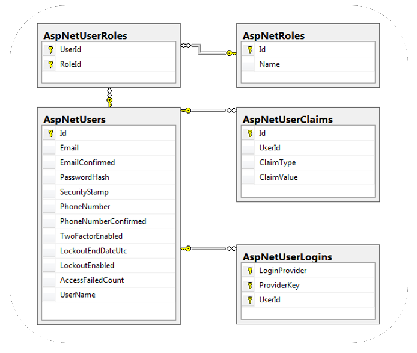
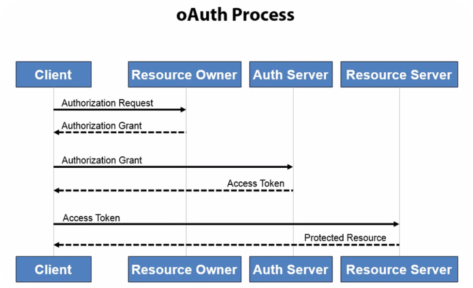

<!-- section start -->
<!-- attr: { class:'slide-title', showInPresentation:true, hasScriptWrapper:true, style:'' } -->
# ASP.NET Identity
<div class="signature">
    <p class="signature-course">Telerik Software Academy</p>
    <p class="signature-initiative">http://academy.telerik.com </p>
    <a href = "ASP.NET Web Forms" class="signature-link">ASP.NET Web Forms</a>
</div>

<!-- attr: { showInPresentation:true, hasScriptWrapper:true, style:'' } -->
# Table of Contents
- Basics of Authentication and Authorization
- Old ASP.NET Membership
  - Windows Authentication
  - Forms Authentication
- Old Users and Roles
- Old Membership Provider
- Getting Current User Information at the server

<!-- attr: { showInPresentation:true, hasScriptWrapper:true, style:'' } -->
# Table of Contents
- Introduction to ASP.NET Identity
- Basic ASP.NET Identity Template
- Database Identity Tables 
- Basic functionality
- Extending the built-in user profile
- User roles
- OAuth 2.0 authentication
- Cookie information

<!-- section start -->
<!-- attr: { class:'slide-section', showInPresentation:true, hasScriptWrapper:true, style:'' } -->
# Authentication and Authorization
##  Main difference

<!-- attr: { showInPresentation:true, style:'' } -->
# Basics
- `Authentication`
  - The process of verifying the identity of a user or computer
  - Questions: Who are you? How you prove it?
  - Credentials can be password, smart card, etc.
- `Authorization`
  - The process of determining what a user is permitted to do on a computer or network
  - Question: What are you allowed to do?

<!-- section start -->
<!-- attr: { class:'slide-section', showInPresentation:true, hasScriptWrapper:true, style:'' } -->
# Old Windows and Forms Authentication in ASP.NET

<!-- attr: { showInPresentation:true, style:'' } -->
# Old Authentication in ASP.NET
- `Windows Authentication`
  - Uses the security features integrated into the Windows operating systems
  - Uses Active Directory / Windows accounts
- `Forms Authentication `
  - Uses a traditional login / logout pages
  - Code associated with a Web form handles users authentication by username / password
  - Users are usually stored in a database

<!-- attr: { showInPresentation:true, style:'' } -->
# Windows Authentication
- In `Windows Authentication `mode the Web application uses the same security scheme that applies to your Windows network
- Network resources and Web applications use the same:
  - User names
  - Passwords
  - Permissions
- It is the default authentication when a new Web site is created

<!-- attr: { showInPresentation:true, style:'' } -->
# Windows Authentication (2)
- The user is authenticated against his username and password in Windows
  - Known as NTLM authentication protocol
- When a user is authorized:
  - ASP.NET issues an authentication ticket (which is a HTTP header)
  - Application executes using the permissions associated with the Windows account
  - The user's session ends when the browser is closed or when the session times out

<!-- attr: { showInPresentation:true, hasScriptWrapper:true, style:'' } -->
# Windows Authentication (3)
- Users who are logged on to the network
  - Are automatically authenticated 
  - Can access the Web application
- To set the authentication to Windows add to the `Web.config`:
- To deny anonymous users add:

```xml
<authentication mode="Windows" />
```

```xml
<authorization>
  <deny users="?"/>
</authorization>
```

<!-- attr: { showInPresentation:true, hasScriptWrapper:true, style:'font-size: 36px' } -->
# Windows Authentication (4)
- The Web server should have NTLM enabled:



<!-- attr: { showInPresentation:true, hasScriptWrapper:true, style:'' } -->
# Windows Authentication (5)

- HTTP requests:

```
GET /Default.aspx HTTP/1.1
…
```

```
HTTP/1.1 401 Unauthorized
WWW-Authenticate: NTLM
```

- HTTP responses:

```
GET /Default.aspx HTTP/1.1
Authorization: NTLM tESsB/ yNY3lb6a0L6vVQEZNqwQn0sqZ…
```

```
HTTP/1.1 200 OK
…
<html> … </html>
```

<!-- attr: { class:'slide-section demo', showInPresentation:true, hasScriptWrapper:true, style:'' } -->
<!-- # Windows Authentication -->
##  [Demo]()

<!-- attr: { showInPresentation:true, style:'' } -->
# Forms Authentication
- `Forms Authentication `uses a Web form to collect login credentials (username / password)
- Users are authenticated by the C# code behind the Web form
- User accounts can be stored in:
  - `Web.config` file
  - Separate user database 
- Users are local for the Web application
  - Not part of Windows or Active Directory

<!-- attr: { showInPresentation:true, hasScriptWrapper:true, style:'' } -->
# Forms Authentication (2)
- Enabling forms authentication:
  - Set authentication mode in the `Web.config `to "`Forms`"
  - Create a login ASPX page
  - Create a file or database to store the user credentials (username, password, etc.)
  - Write code to authenticate the users against the users file or database

```xml
<authentication mode="Forms" />
```

<!-- attr: { showInPresentation:true, hasScriptWrapper:true, style:'font-size: 40px' } -->
# Configuring Authorization in Web.config
- To deny someone's access add `<deny` `users="…">` in the `<authorization>` tag
- To allow someone's access add `<allow` `users="…">` in the authorization tag
- `<deny` `users="?"` `/>` denies anonymous access
- `<deny` `users="x"` `/>` denies access to all users

```xml
<system.web>
  <authorization>
    <deny users="?"/>
  </authorization>
</system.web>
```

<!-- attr: { showInPresentation:true, hasScriptWrapper:true, style:'font-size: 40px' } -->
# Configuring Authorization in Web.config (2)
- Specifying authorization rules in `Web.config`:
- The `deny`/`allow` stops the authorization process at the first match
  - Example: if a user is authorized as `Pesho`, the tag `<deny users="x" />` is not processed
 
```xml
<location path="RegisterUser.aspx">
  <system.web>
    <authorization>
      <allow roles="admin" />
      <allow users="Pesho,Gosho" />
      <deny users="x" />
    </authorization>
  </system.web>
</location>
```

<!-- attr: { showInPresentation:true, style:'font-size: 36px' } -->
# Implementing Login / Logout
- Logging-in using credentials from `Web.config`:
```cs
if (FormsAuthentication.Authenticate(username, passwd))
{
  // This method creates a cookie (or hidden field)
  // holding the authentication ticket.
  FormsAuthentication.RedirectFromLoginPage(
    username, false);
}
else
{
  lblError.Text = "Invalid login!";
}
```
- Logging-out the currently logged user:
```cs
FormsAuthentication.SignOut();
```
<div class="fragment-balloon" style="width:250px; top:60%; left:10%"></div>
- Displaying the currently logged user:
```cs
lblInfo.Text = "User: " + Page.User.Identity.Name;
```

<!-- attr: { class:'slide-section demo', showInPresentation:true, hasScriptWrapper:true, style:'' } -->
<!-- # Forms Authentication -->
##  [Demo]()

<!-- section start -->
<!-- attr: { class:'slide-section', showInPresentation:true, hasScriptWrapper:true, style:'' } -->
# Old Users and Roles
##  Membership Provider and Roles Provider

<!-- attr: { showInPresentation:true, hasScriptWrapper:true, style:'' } -->
# Users, Roles and Authentication
- `User` is a client with a Web browser running a session with the Web application
- Users can authenticate (login) in the Web application
  - Once a user is logged-in, a set of roles and permissions are assigned to him
  - Authorization in ASP.NET is				 based on users and roles
  - Authorization rules specify what			 permissions each user / role has

<!-- attr: { showInPresentation:true, style:'' } -->
# ASP.NET Membership Providers
- Membership providers in ASP.NET 
  - Simplify common authentication and user management tasks
    - `CreateUser()`
    - `DeleteUser()`
    - `GeneratePassword()`
    - `ValidateUser()`
    - `…`
  - Can store user credentials in database / file / etc.

<!-- attr: { showInPresentation:true, style:'' } -->
# Roles in ASP.NET
- `Roles` in ASP.NET allow assigning permissions to a group of users
  - E.g. "`Admins`" role could have more privileges than "`Guests`" role
- A user account can be assigned to multiple roles in the same time
  - E.g. user "`Peter`" can be member of "`Admins`" and "`TrustedUsers`" roles
- Permissions can be granted to multiple users sharing the same role

<!-- attr: { showInPresentation:true, style:'' } -->
# ASP.NET Role Providers
- Role providers in ASP.NET
  - Simplify common authorization tasks and role management tasks
    - `CreateRole()`
    - `IsUserInRole()`
    - `GetAllRoles()`
    - `GetRolesForUser()`
    - `…`
  - Can store user credentials in database / file / etc.

<!-- attr: { showInPresentation:true, hasScriptWrapper:true, style:'font-size:44px' } -->
# Registering a Membership Provider
- Adding membership provider to the `Web.config`

```xml
<membership defaultProvider="MyMembershipProvider">	     
  <providers>
    <add connectionStringName="UsersConnectionString"
      minRequiredPasswordLength="6"
      requiresQuestionAndAnswer="true" 
      enablePasswordRetrieval="false"
      requiresUniqueEmail="false" 
      applicationName="/MyApp" 
      minRequiredNonalphanumericCharacters="1"
      name="MyMembershipProvider" 
      type="System.Web.Security.SqlMembershipProvider"/>
  </providers>
</membership>
```

<!-- attr: { showInPresentation:true, hasScriptWrapper:true, style:'font-size:44px' } -->
# Registering a Role Provider
- To register role provider in ASP.NET 4.0 add the following to the `Web.config`:

```xml
<roleManager enabled="true" defaultProvider="MyRoleProvider">
  <providers>
    <add connectionStringName="UsersConnectionString"
      name="MyRoleProvider"
      type="System.Web.Security.SqlRoleProvider" />
  </providers>
</roleManager>
<connectionStrings>
  <add name="UsersConnectionString"
    connectionString="Data Source=.\SQLEXPRESS;Initial
      Catalog=Users;Integrated Security=True"
    providerName="System.Data.SqlClient" />
</connectionStrings>
```

<!-- attr: { showInPresentation:true, style:'font-size: 44px' } -->
# The SQL Registration Tool: aspnet_regsql
- The built-in classes System.Web.Security. SqlMembershipProvider and System.Web. Security.SqlRoleProvider use a set of standard tables in the SQL Server
  - Can be created by the ASP.NET SQL Server Registration tool (`aspnet_regsql.exe`)
  - The `aspnet_regsql.exe` utility is installed as part of with ASP.NET 4.0:

```
C:\WINDOWS\Microsoft.NET\Framework\v4.0.30319\ aspnet_regsql.exe
```

<!-- attr: { showInPresentation:true, hasScriptWrapper:true, style:'' } -->
# The Standard ASP.NET Applications Database Schema


<!-- attr: { showInPresentation:true, style:'' } -->
# ASP.NET Membership API
- Implementing login:

```cs
if (Membership.ValidateUser(username, password))
{
  FormsAuthentication.RedirectFromLoginPage(
    username, false);
}
```
- Implementing logout:

```cs
FormsAuthentication.SignOut();
```
- Creating new user:

```cs
Membership.CreateUser(username, password);
```

<!-- attr: { showInPresentation:true, style:'font-size: 44px' } -->
# ASP.NET Membership API (2)

- Getting the currently logged user:

```cs
MembershipUser currentUser = Membership.GetUser();
```
- Creating new role:

```cs
Roles.CreateRole("Admins");
```
- Adding user to existing role:

```cs
Roles.AddUserToRole("admin", "Admins");
```
- Deleting user / role:

```cs
Membership.DeleteUser("admin", true);
Roles.DeleteRole("Admins");
```

<!-- attr: { class:'slide-section demo', showInPresentation:true, hasScriptWrapper:true, style:'' } -->
<!-- # Membership Provider -->
##  [Demo]()

<!-- section start -->
<!-- attr: { class:'slide-section', showInPresentation:true, hasScriptWrapper:true, style:'' } -->
# Getting User Information
##  From the Back-end C&#35;

<!-- attr: { showInPresentation:true, style:'' } -->
# Getting User Information
- You can get basic user information by using the User class in the back-end
- By User class:
  - `IsInRole(string)` method
  - `Identity` property
    - string `Name` property
    - bool `IsAuthenticated` property
    - string `AuthenticationType` property

<!-- section start -->
<!-- attr: { class:'slide-section', showInPresentation:true, hasScriptWrapper:true, style:'' } -->
# Introduction to Identity
##  Who are you?

<!-- attr: { showInPresentation:true, hasScriptWrapper:true, style:'' } -->
# ASP.NET Identity
- The new membership system for building ASP.NET applications
- Makes it easy to integrate user specific profile data with the application data
- Allows you to control the persistence model of your application
  - Local database 
  - External service store

<!-- attr: { showInPresentation:true, hasScriptWrapper:true, style:'' } -->
# Basic Template With Identity
- Creates basic web application
- Contains useful libraries
- Contains User access options
- Ready to use:
  - Models for extending profiles
  - Register, Login, Manage pages
  - Local cookie-based authentication
  - Remote OAuth services – Facebook, Google, Twitter, etc. 

<!-- section start -->
<!-- attr: { class:'slide-section', showInPresentation:true, style:'' } -->
# Basic Template
##  Live Demo with Web Forms and MVC

<!-- section start -->
<!-- attr: { class:'slide-section', showInPresentation:true, hasScriptWrapper:true, style:'' } -->
# Identity Database
##  Where are you?

<!-- attr: { showInPresentation:true, style:'' } -->
# Local Database Tables
- Tables
  - `AspNetRoles` – role types
  - `AspNetUserClaims` – external services claims
  - `AspNetUserLogins` – user logins and types
  - `AspNetUserRoles` – user roles
  - `AspNetUsers` – user profile information

<!-- attr: { showInPresentation:true, hasScriptWrapper:true, style:'' } -->
# Local Database Tables



<!-- section start -->
<!-- attr: { class:'slide-section', showInPresentation:true, style:'' } -->
# Local Database
##  Live Demo with Web Forms and MVC 5

<!-- section start -->
<!-- attr: { class:'slide-section', showInPresentation:true, hasScriptWrapper:true, style:'' } -->
# Basic Functionality
##  This is how we do it!

<!-- attr: { showInPresentation:true, hasScriptWrapper:true, style:'' } -->
# Register
- `Front-end`
  - Provide fields for Username, Password, etc.
  - Provide submit button
  - Provide validation messages
- `Back-end`
  - Get `UserManager`
  - Create `User` instance
  - Create local user through `IdentityManager`
  - If success – sign in and redirect the page

<!-- attr: { showInPresentation:true, hasScriptWrapper:true, style:'' } -->
# Login
- `Front-end`
  - Provide fields for Username, Password
  - Provide submit button
  - Provide validation messages
- `Back-end`
  - Get `UserManager`
  - Use `PasswordSignIn`
  - Log in the user
  - If success – redirect the page to return URL

<!-- section start -->
<!-- attr: { class:'slide-section', showInPresentation:true, style:'' } -->
# Register and Login
##  Live Demo with Web Forms and MVC 5

<!-- section start -->
<!-- attr: { class:'slide-section', showInPresentation:true, hasScriptWrapper:true, style:'' } -->
# Extending User Profile
##  Additional properties

<!-- attr: { showInPresentation:true, style:'' } -->
# Extending User Profile
- Steps
  - Add properties to `Models/IdentityModel/ApplicationUser`
  - `ApplicationDbContext` should inherit `IdentityDbContext` and have constructor
  - Enable `migrations` for the project/data layer
  - In `Global.asax` add database initializer
  - All `UserManager` instances should take `ApplicationDbContext` as parameter
  - Use `ApplicationUser` everywhere

<!-- section start -->
<!-- attr: { class:'slide-section', showInPresentation:true, style:'' } -->
# Extended User Profile
##  Live Demo with Web Forms

<!-- section start -->
<!-- attr: { class:'slide-section', showInPresentation:true, hasScriptWrapper:true, style:'' } -->
# User Roles
##  Who is authorized

<!-- attr: { showInPresentation:true, hasScriptWrapper:true, style:'' } -->
# User Roles
- Role-based authorization
- Control over the application modules
- Categorizing users and memberships
- Defined in `Web.config`

```xml
<location path="About">
    <system.web>
      <authorization>
        <allow roles="Admin"/>
        <deny users="x"/>
      </authorization>
    </system.web>
</location>
```

<!-- section start -->
<!-- attr: { class:'slide-section', showInPresentation:true, style:'' } -->
# User Roles
##  Live Demo with Web Forms

<!-- section start -->
<!-- attr: { class:'slide-section', showInPresentation:true, hasScriptWrapper:true, style:'' } -->
# Remote Authentication
##  Easier than your ex!

<!-- attr: { showInPresentation:true, hasScriptWrapper:true, style:'' } -->
# Claims-base authentication (1)
- Claims
  - Piece of information identifying user
  - Sent as key-value pairs
  - Contains authentication token and/or signature
- Claims-based authentication
  - Users authenticate on remote system
  - Information is passed to the application
  - User is authenticated and recognized

<!-- attr: { showInPresentation:true, style:'' } -->
# Claims-base authentication (2)
- Authentication flow
  - User makes request to application
  - System redirects to external page
  - After authentication the external system returns back to the application with user information
  - Application makes request to external system to validate user
  - User gets access to the application

<!-- attr: { showInPresentation:true, hasScriptWrapper:true, style:'' } -->
# OAuth2
- OAuth
  - Allow secure authentication
  - Simple and standard protocol
  - Can be used by web, desktop or mobile apps
- Steps
  - Users tries to authenticate at application
  - Application relies on remote service
  - Application receives access token
  - User gets access

<!-- attr: { showInPresentation:true, hasScriptWrapper:true, style:'' } -->
# OAuth2 Process



<!-- section start -->
<!-- attr: { class:'slide-section', showInPresentation:true, style:'' } -->
# Facebook Authentication
##  Live Demo with Web Forms

<!-- section start -->
<!-- attr: { class:'slide-section', showInPresentation:true, hasScriptWrapper:true, style:'' } -->
# Cookie Information
##  Where to find user information

<!-- attr: { showInPresentation:true, hasScriptWrapper:true, style:'' } -->
# Cookie
- Identity cookie: .AspNet.Application
- Contains information about the application
- Contains information about the logged user
- Heavily encrypted
- If wrong hands find it – serious damage!
- For security – use https/SSL protocol

<!-- section start -->
<!-- attr: { class:'slide-section', showInPresentation:true, style:'' } -->
# Cookie Information
##  Live Demo with Web Forms

<!-- attr: { showInPresentation:true, hasScriptWrapper:true, style:'' } -->
# ASP.NET Identity


<div style="position: absolute; bottom: 1em; right: 0; font-size: 26px;">http://academy.telerik.com</div>

<!-- attr: { showInPresentation:true, style:'' } -->
# Homework
- Create a Chat canal web application.
  - Users must have First name, Last name and e-mail fields. Display name should be First name + Last Name
  - There is only one canal where every registered user can only post (create) a message
  - There must be Moderator role, which can post and edit all the posted content
  - There must be Administrator role, which can post, edit and delete all the posted content

<!-- attr: { showInPresentation:true, hasScriptWrapper:true, style:'' } -->
# Free Trainings @ Telerik Academy
- C# Programming @ Telerik Academy
    - http://csharpfundamentals.telerik.com
  - Telerik Software Academy
    - http://academy.telerik.com
  - Telerik Academy @ Facebook
    - https://facebook.com/TelerikAcademy
  - Telerik Software Academy Forums
    - http://forums.academy.telerik.com