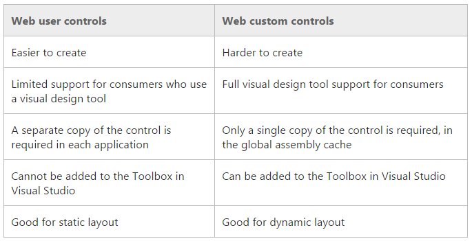
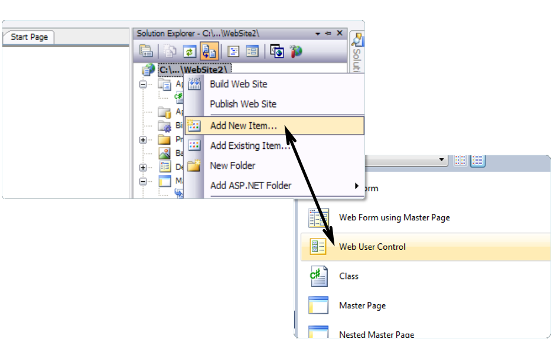

<!-- section start -->
<!-- attr: { class:'slide-title', showInPresentation:true, hasScriptWrapper:true, style:'' } -->
# ASP.NET User Controls
##  Creating and Using .ASCX User Controls
<div class="signature">
    <p class="signature-course">`.ASCX`</p>
    <p class="signature-initiative">Telerik Software Academy</p>
    <a href = "http://academy.telerik.com " class="signature-link">http://academy.telerik.com </a>
</div>

<!-- attr: { showInPresentation:true, hasScriptWrapper:true, style:'' } -->
# Table of Contents 
- Creating and Using Web User Controls
- Creating and Using Web Custom Controls
- Case Study: Creating an Info / Error / Success Notification User Control

<!-- attr: { showInPresentation:true, style:'' } -->
# ASP.NET User Controlsand Custom Controls
- ASP.NET offers two ways of building reusable UI components:
  - `Web User Controls`
    - UI server controls (reusable code snippets), designed in Visual Studio
    - Consist of `.ascx` and `.ascx.cs` files, inherit from `UserControl`
  - `Web Custom Controls`
    - Plain C# code inheriting from `WebControl`
    - No HTML, rendered in C# code

<!-- attr: { showInPresentation:true, hasScriptWrapper:true, style:'' } -->
# ASP.NET User Controlsand Custom Controls(2)


<!-- section start -->
<!-- attr: { class:'slide-section', showInPresentation:true, hasScriptWrapper:true, style:'' } -->
# ASP.NET User Controls

<!-- attr: { showInPresentation:true, style:'' } -->
# User Controls
  - `Web user controls` are reusable UI components used in ASP.NET Web Forms applications
- User controls derive from `UserControl` which derive from `TemplateControl`
  - Similar to a Web form
  - Have `HTML code` and `C# code` (code behind)
  - Could have properties and events
  - Allow developers to create their own controls with own UI and custom behavior

<!-- attr: { showInPresentation:true, hasScriptWrapper:true, style:'' } -->
# User Controls (2)
- Adding a Web User Control from Visual Studio:



<!-- attr: { showInPresentation:true, style:'' } -->
# User Controls (3)
- A Web user control is:
  - An reusable ASP.NET code snippet that can be nested as part of an ASP.NET page
  - A server component which offers a user interface and attached logic
    - Server side logic and lifecycle events (C# code behind)
    - Client-side logic (JavaScript code)
  - Shared between the pages of the application
  - Cannot be displayed directly in the browser

<!-- attr: { showInPresentation:true, hasScriptWrapper:true, style:'' } -->
# User Controls (4)
- Differs from custom server controls
  - Custom controls are advanced and beyond the scope of the course 
- Consists of HTML and code
- Doesn’t contain `<head>`, `<body> `and `<form> `HTML tags
- Uses `@Control` instead of `@Page`

<!-- attr: { showInPresentation:true, style:'' } -->
# User Controls – Advantages
- Independent
  - Use separate namespaces for the variables
  - Avoid name collisions with the names of methods and properties of the page
- Reusable
  - User controls can be used more than once on a single page 
    - No conflicts with properties and methods
- Language neutrality
  - User controls can be written in a language different of the one used in the page

<!-- attr: { showInPresentation:true, style:'' } -->
# Sharing of User Controls
- User controls can be used throughout an application
- Cannot be shared between two Web applications
  - Except by the copy&paste "approach" : ) 
- Another approach is to create a Web custom control
  - Everything is manually written

<!-- attr: { showInPresentation:true, hasScriptWrapper:true, style:'font-size: 44px' } -->
# Using User Controls
- A user control can be added to each ASP.NET Web form
- The form is called "`host`"
- The form adds the control by using the `@Register` directive

```aspx
<%@ Register TagPrefix="demo" TagName="SomeName"
  Src="NumberBox.ascx"%>
```
- `TagName` defines the name used by tags that will insert an instance of the control
- `Src` is the path to the user control

<!-- attr: { showInPresentation:true, hasScriptWrapper:true, style:'font-size: 40px' } -->
# Example: Welcome Label
- We want to create a "Welcome Label" user control
  - Like the `<asp:Label>` control
  - Has `Name` and says "Welcome, Name"
  - Has `Color` and `AlternateColor` (on mouse over)

<p style="font-size: 30px">WelcomeLabel.ascx</p>

```html
<%@ Control Language="C#" AutoEventWireup="true"
  CodeBehind="WelcomeLabel.ascx.cs"
  Inherits="Custom_Controls_Demo.WelcomeLabel" %>
<asp:Label ID="LabelWelcome" runat="server" />
```
<p style="font-size: 30px">WelcomeLabel.ascx.cs</p>

```html
public partial class WelcomeLabel : System.Web.UI.UserControl
{
  …
}
```

<!-- attr: { class:'slide-section demo', showInPresentation:true, hasScriptWrapper:true, style:'' } -->
<!-- # Welcome Label ASCX -->
##  [Demo]()

<!-- attr: { showInPresentation:true, hasScriptWrapper:true, style:'font-size: 42px' } -->
# Example: Numeric Box
- We want to create a "Numeric" user control
  - Like the `<asp:TextBox>` control
  - For integer numbers only
  - With "+" and "-" buttons

<p style="font-size: 30px">NumericBox.ascx</p>
```aspx
<%@ Control Language="C#" CodeBehind="NumericBox.ascx.cs" … %>
<asp:TextBox ID="TextBoxNumber" runat="server" … >
<asp:Button ID="ButtonIncrease" runat="server" Text="+" … >
<asp:Button ID="ButtonDecrease" runat="server" Text="-" … >
```

<p style="font-size: 30px">NumericBox.ascx.cs</p>
```cs
public partial class NumericBox : System.Web.UI.UserControl
{
  …
}
```

<!-- attr: { class:'slide-section demo', showInPresentation:true, hasScriptWrapper:true, style:'' } -->
<!-- # Numeric Box -->
##  [Demo]()

<!-- section start -->
<!-- attr: { class:'slide-section', showInPresentation:true, hasScriptWrapper:true, style:'' } -->
# ASP.NET Custom Controls

<!-- attr: { showInPresentation:true, style:'' } -->
# ASP.NET Custom Controls
- `Web custom controls`
  - Plain C# code inheriting from `WebControl`
  - No HTML, rendered in C# code
  - Attributes `[Category("…")]` and` [Description("…")]` serve for interaction with the Visual Studio's Property Designer
  - The `RenderContents` method renders the control as HTML code

<!-- attr: { class:'slide-section demo', showInPresentation:true, hasScriptWrapper:true, style:'' } -->
<!-- # ASP.NET CustomControl: SEOPlugin -->
##  [Demo]()

<!-- attr: { showInPresentation:true, style:'font-size: 42px' } -->
# Creating an Error / Success Notification User Control
- Create a user control for displaying message boxes: `ErrorSuccessNotifier.ascx`
  - Keep all its assets (HTML code, C# code, images, styles and client-side scripts) in its own directory: `/Controls/ErrorSuccessNotifier/`
- Keep a list of messages in the `Session` object
  - Message types: `Success`, `Info`, `Warning`, `Error`
  - Render the messages dynamically as panels
- Include the CSS and client-side scripts on demand through the `ClientScriptManager`

<!-- attr: { class:'slide-section demo', showInPresentation:true, hasScriptWrapper:true, style:'' } -->
<!-- # Creating an Error / Success Notification User Control -->
##  [Demo]()

<!-- attr: { showInPresentation:true, hasScriptWrapper:true, style:'' } -->
# ASP.NET User Controls


<div style="position: absolute; bottom: 1em; right: 0; font-size: 26px;">http://academy.telerik.com</div>