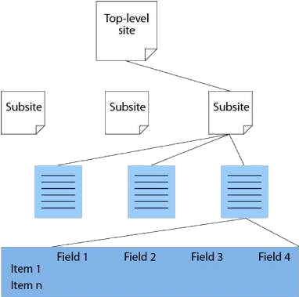

<!-- section start -->
<!-- attr: { class:'slide-title', showInPresentation:true, hasScriptWrapper:true, style:'' } -->
# Introduction to SharePoint
<div class="signature">
    <p class="signature-initiative">Telerik Software Academy</p>
    <a href = "http://academy.telerik.com " class="signature-link">http://academy.telerik.com </a>
</div>


<!-- attr: { showInPresentation:true, hasScriptWrapper:true, style:'' } -->
# Table of Contents 
- What is SharePoint?
- Basic concepts and structure
  - Sites
  - Lists and Document Libraries
  - Web-parts
  - Pages
  - Search
- SharePoint editions
- SPServices

<!-- attr: { showInPresentation:true, hasScriptWrapper:true, style:'' } -->
# What is SharePoint?
- SharePoint is a web application framework and platform developed by Microsoft.
  - First launched in 2001
  - Built upon the ASP.Net framework 
  - Additional layer of services and codebase
  - Integrates: 
    - Intranet
    - content management and document management
- According to Microsoft, SharePoint is used by 78% of Fortune 500 companies.

<!-- attr: { showInPresentation:true, hasScriptWrapper:true, style:'' } -->
# SharePoint Editions
- Microsoft SharePoint Foundation
  - Underlying technology for all SharePoint sites
  - Free on-premises deployment
    - But requires Microsoft Windows Server
- Microsoft Search Server Express
- Microsoft SharePoint Enterprise
- Office 365 - SharePoint Online
  - Cloud-based service, hosted by Microsoft

<!-- attr: { showInPresentation:true, hasScriptWrapper:true, style:'font-size: 40px' } -->
# The SharePoint Wheel
- Sites
  - <p style="font-size: 34px">Audience targeting, governance tools, Secure store service, web analytics functionality</p>
- Communities
  - <p style="font-size: 34px">'MySites' (personal profiles including skills management, and search tools), enterprise wikis, organization hierarchy browser, tags and notes</p>
- Content
  - <p style="font-size: 34px">Improved tooling and compliance for document & record management, managed metadata, word automation services, content type management</p>

<!-- attr: { showInPresentation:true, hasScriptWrapper:true, style:'font-size: 40px' } -->
# The SharePoint Wheel (2)
- Search
  - <p style="font-size: 34px">Better search results, search customization abilities, mobile search, 'Did you mean?', OS search integration, Faceted Search, and metadata/relevancy/date/location based refinement options</p>
- Insights
  - <p style="font-size: 34px">Information from any part of the organization can be surfaced inside useful contexts, providing information that can improve effectiveness.</p>
- Composites
  - <p style="font-size: 34px">Pre-built workflow templates, BCS profile pages</p>

<!-- attr: { showInPresentation:true, hasScriptWrapper:true, style:'' } -->
# Common Uses
- The most common uses of SharePoint
  - Intranet portals
  - Enterprise content and document management
  - Extranet portal
  - Internet sites
  - Software framework

<!-- attr: { showInPresentation:true, hasScriptWrapper:true, style:'font-size: 46px' } -->
# Configuration and customization
- Web-based configuration
  - Manipulate content
  - Manage user permissions
  - Manage definitions and properties 
- SharePoint Designer
  - The 'Client Object Model‘ (CSOM) 
  - 'Sand-boxed' solutions
    - In multi-tenant cloud environments, these are the only customizations that are typically allowed.
  - Farm solutions

<!-- attr: { showInPresentation:true, hasScriptWrapper:true, style:'' } -->
# Sites
- Sites and Site Collections
  - <p style="font-size: 34px">SP Site - collection of pages, site templates, lists, and libraries</p>
  - <p style="font-size: 34px">A site may contain sub-sites, and those sites may contain further sub-sites</p>
- MySite 
  - <p style="font-size: 34px">personal site for each user</p>



<!-- attr: { showInPresentation:true, hasScriptWrapper:true, style:'' } -->
# Lists and Libraries
- Lists
  - Workflows
  - Item-level or list-level permission
  - Version history tracking
  - Multiple content-types
  - External data sources
- Library
  - list where each item in the list refers to a file
- Content-type

<!-- attr: { showInPresentation:true, hasScriptWrapper:true, style:'font-size: 44px' } -->
# Web-parts
- Typical use:
  - <p style="font-size: 34px">Displaying content defined in the web-part's settings</p>
  - <p style="font-size: 34px">Displaying items from Lists/Libraries</p>
  - <p style="font-size: 34px">Providing access to features in the SharePoint platform</p>
  - <p style="font-size: 34px">Providing a user interface into other products</p>
- Web-parts also support connections to other web-parts on the page
- Web-parts based on completely custom code can be built in Microsoft Visual Studio 2015.

<!-- attr: { showInPresentation:true, hasScriptWrapper:true, style:'' } -->
# Pages and Search
- Page content-types:
  - Wiki page
  - Web-part page
  - Publishing page
- Microsoft produces a free product called Microsoft Search Server Express

<!-- attr: { showInPresentation:true, hasScriptWrapper:true, style:'' } -->
# Workflows
- Workflow - automated movement of documents or items through a sequence of actions or tasks that are related to a business process
  - Approval
  - Collect Feedback
  - Collect Signatures
  - Disposition Approval
  - Three-state
  - Group Approval
  - Translation Management


<!-- attr: { showInPresentation:true, hasScriptWrapper:true, style:'' } -->
# SPServices
- Project Description
  - SPServices is a jQuery library which abstracts SharePoint's Web Services and makes them easier to use. It also includes functions which use the various Web Service operations to provide more useful (and cool) capabilities. It works entirely client side and requires no server install.
<br>
<br>
- http://spservices.codeplex.com/

<!-- attr: { showInPresentation:true, style:'font-size: 40px' } -->
# SPServices
- Example: Get List Items

```javascript
$().SPServices({
    operation: "GetListItems",
    async: false,
    listName: "Announcements",
    CAMLViewFields: "&#60;ViewFields&#62;&#60;FieldRef Name='Title'/&#62;
&#60;/ViewFields&#62;",
    completefunc: function (xData, Status) { 
      $(xData.responseXML)
                  .SPFilterNode("z:row")
                  .each(function() {
                    var liHtml = "&#60;li&#62;" 
                                + $(this).attr("ows_Title") 
                                + "&#60;/li&#62;";
                    $("#tasksUL").append(liHtml);
                  });
    }
  });
```

<!-- attr: { showInPresentation:true, hasScriptWrapper:true, style:'' } -->
# ASP.NET User Controls


<div style="position: absolute; bottom: 1em; right: 0; font-size: 26px;">http://academy.telerik.com</div>

<!-- attr: { showInPresentation:true, hasScriptWrapper:true, style:'font-size: 42px' } -->
# Free Trainings @ Telerik Academy
- "Web Design with HTML 5, CSS 3 and JavaScript" course @ Telerik Academy
    - http://html5course.telerik.com
  - Telerik Software Academy
    - http://academy.telerik.com
  - Telerik Academy @ Facebook
    - https://facebook.com/TelerikAcademy
  - Telerik Software Academy Forums
    - http://forums.academy.telerik.com